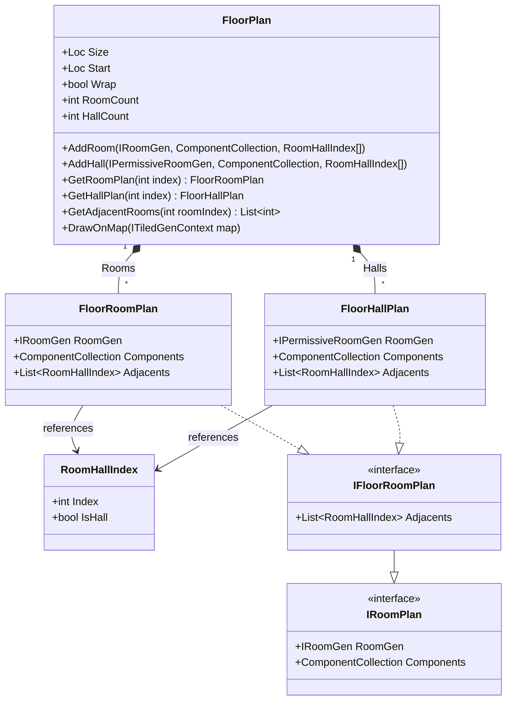
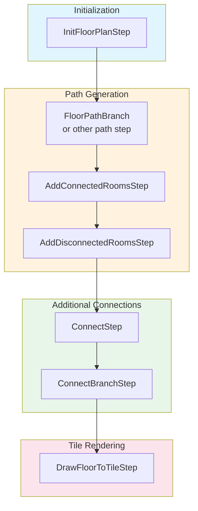

# FloorPlan - Freeform Room Generation

[](https://github.com/audinowho/RogueElements/actions)
[](https://www.nuget.org/packages/RogueElements/)

The FloorPlan system provides **freeform room placement** where rooms and halls can be positioned anywhere within the map bounds, without being constrained to a grid. This gives maximum flexibility for organic, irregular dungeon layouts.

## What is a FloorPlan?

A `FloorPlan` is an abstract representation of a dungeon layout consisting of:
- **Rooms** - Spaces where gameplay occurs (combat, exploration, treasure)
- **Halls** - Corridors connecting rooms
- **Adjacency Graph** - Tracks which rooms/halls are connected

Unlike `GridPlan`, rooms in a `FloorPlan` can be placed at any position and have any size, allowing for natural, non-uniform layouts.

## Class Diagram



## Key Classes

### `FloorPlan`

The main data structure holding all rooms and halls.

```csharp
// From FloorPlan.cs
public class FloorPlan
{
    public Loc Size { get; private set; }
    public Loc Start { get; private set; }
    public bool Wrap { get; private set; }

    public virtual int RoomCount => this.Rooms.Count;
    public virtual int HallCount => this.Halls.Count;

    // Initialize the floor plan bounds
    public void InitSize(Loc size, bool wrap = false);

    // Add a room connected to existing rooms/halls
    public void AddRoom(IRoomGen gen, ComponentCollection components, params RoomHallIndex[] attached);

    // Add a hall (corridor) connecting rooms
    public void AddHall(IPermissiveRoomGen gen, ComponentCollection components, params RoomHallIndex[] attached);

    // Get adjacent room indices (traverses through halls)
    public virtual List<int> GetAdjacentRooms(int roomIndex);

    // Render all rooms and halls to the tile map
    public void DrawOnMap(ITiledGenContext map);
}
```

### `FloorRoomPlan`

Wraps an `IRoomGen` with metadata and connectivity information.

```csharp
// From FloorRoomPlan.cs
public class FloorRoomPlan : IFloorRoomPlan
{
    public IRoomGen RoomGen { get; set; }           // The room generator
    public ComponentCollection Components { get; }  // Tags/metadata
    public List<RoomHallIndex> Adjacents { get; }   // Connected rooms/halls
}
```

### `FloorHallPlan`

Similar to `FloorRoomPlan` but uses `IPermissiveRoomGen` (can connect from any side).

```csharp
// From FloorHallPlan.cs
public class FloorHallPlan : IFloorRoomPlan
{
    public IPermissiveRoomGen RoomGen { get; set; }
    public ComponentCollection Components { get; }
    public List<RoomHallIndex> Adjacents { get; }
}
```

### `RoomHallIndex`

A reference to either a room or hall by index.

```csharp
// From RoomHallIndex.cs
public struct RoomHallIndex
{
    public bool IsHall;  // true = hall, false = room
    public int Index;    // Index in the respective list
}
```

## Common Steps

### 1. `InitFloorPlanStep<T>` - Initialize the Plan

Creates an empty floor plan with specified dimensions.

```csharp
// From InitFloorPlanStep.cs
[Serializable]
public class InitFloorPlanStep<T> : GenStep<T>
    where T : class, IFloorPlanGenContext
{
    public int Width { get; set; }
    public int Height { get; set; }
    public bool Wrap { get; set; }  // Wrapping (toroidal) map

    public override void Apply(T map)
    {
        var floorPlan = new FloorPlan();
        floorPlan.InitSize(new Loc(this.Width, this.Height), this.Wrap);
        map.InitPlan(floorPlan);
    }
}
```

**Usage:**
```csharp
// Initialize a 54x40 floor plan
layout.GenSteps.Add(-2, new InitFloorPlanStep<MapGenContext>(54, 40));
```

### 2. `FloorPathBranch<T>` - Generate Branching Paths

Creates a minimum spanning tree of connected rooms and halls.

```csharp
// From IFloorPathBranch.cs
[Serializable]
public class FloorPathBranch<T> : FloorPathStartStepGeneric<T>
    where T : class, IFloorPlanGenContext
{
    // Percentage of floor area to fill with rooms
    public RandRange FillPercent { get; set; }

    // Chance (0-100) to use a hall between rooms
    public int HallPercent { get; set; }

    // How much the path branches (0=linear, 50=tree, 100+=bushy)
    public RandRange BranchRatio { get; set; }
}
```

**Usage:**
```csharp
var path = new FloorPathBranch<MapGenContext>(genericRooms, genericHalls)
{
    HallPercent = 50,
    FillPercent = new RandRange(45),
    BranchRatio = new RandRange(0, 25),
};
layout.GenSteps.Add(-1, path);
```

### 3. `ConnectStep<T>` - Add Extra Connections

Finds disconnected or distant rooms and connects them with halls.

```csharp
// From ConnectStep.cs
[Serializable]
public abstract class ConnectStep<T> : FloorPlanStep<T>
    where T : class, IFloorPlanGenContext
{
    // Filters to determine which rooms can be connected
    public List<BaseRoomFilter> Filters { get; set; }

    // Hall types to use for connections
    public IRandPicker<PermissiveRoomGen<T>> GenericHalls { get; set; }

    // Components to add to newly created halls
    public ComponentCollection Components { get; set; }
}
```

### 4. `DrawFloorToTileStep<T>` - Render to Tiles

Converts the abstract floor plan into actual tiles on the map.

```csharp
// From DrawFloorToTileStep.cs
[Serializable]
public class DrawFloorToTileStep<T> : GenStep<T>
    where T : class, IFloorPlanGenContext
{
    // Tiles to pad around the border as wall terrain
    public int Padding { get; set; }

    public override void Apply(T map)
    {
        // Create the tile array
        map.CreateNew(
            map.RoomPlan.DrawRect.Width + (2 * this.Padding),
            map.RoomPlan.DrawRect.Height + (2 * this.Padding),
            map.RoomPlan.Wrap);

        // Fill with walls
        for (int ii = 0; ii < map.Width; ii++)
            for (int jj = 0; jj < map.Height; jj++)
                map.SetTile(new Loc(ii, jj), map.WallTerrain.Copy());

        // Draw all rooms and halls
        map.RoomPlan.DrawOnMap(map);
    }
}
```

**Usage:**
```csharp
// Draw with 1-tile wall padding around the border
layout.GenSteps.Add(0, new DrawFloorToTileStep<MapGenContext>(1));
```

## Generation Pipeline



## When to Use FloorPlan vs Grid

| Feature | FloorPlan | GridPlan |
|---------|-----------|----------|
| Room placement | Anywhere | Fixed grid cells |
| Room sizes | Any size | Constrained by cell size |
| Layout style | Organic, irregular | Structured, uniform |
| Use case | Natural caves, varied dungeons | Classic roguelike grids |
| Complexity | More complex collision handling | Simpler cell-based logic |
| Performance | Slower (collision checks) | Faster (index-based) |

**Choose FloorPlan when:**
- You want organic, natural-looking layouts
- Rooms should vary significantly in size
- You don't need rigid structure

**Choose GridPlan when:**
- You want predictable, structured layouts
- Classic roguelike grid aesthetics
- Performance is critical
- You need to convert to FloorPlan later anyway

## Complete Example

From `Ex2_Rooms/Example2.cs`:

```csharp
public static void Run()
{
    var layout = new MapGen<MapGenContext>();

    // Step 1: Initialize a 54x40 floor plan
    InitFloorPlanStep<MapGenContext> startGen = new InitFloorPlanStep<MapGenContext>(54, 40);
    layout.GenSteps.Add(-2, startGen);

    // Step 2: Define room types
    var genericRooms = new SpawnList<RoomGen<MapGenContext>>
    {
        { new RoomGenSquare<MapGenContext>(new RandRange(4, 8), new RandRange(4, 8)), 10 },
        { new RoomGenRound<MapGenContext>(new RandRange(5, 9), new RandRange(5, 9)), 10 },
    };

    // Step 3: Define hall types
    var genericHalls = new SpawnList<PermissiveRoomGen<MapGenContext>>
    {
        { new RoomGenAngledHall<MapGenContext>(0, new RandRange(3, 7), new RandRange(3, 7)), 10 },
        { new RoomGenSquare<MapGenContext>(new RandRange(1), new RandRange(1)), 20 },
    };

    // Step 4: Generate branching path
    FloorPathBranch<MapGenContext> path = new FloorPathBranch<MapGenContext>(genericRooms, genericHalls)
    {
        HallPercent = 50,
        FillPercent = new RandRange(45),
        BranchRatio = new RandRange(0, 25),
    };
    layout.GenSteps.Add(-1, path);

    // Step 5: Render to tiles with 1-tile border
    layout.GenSteps.Add(0, new DrawFloorToTileStep<MapGenContext>(1));

    // Generate!
    MapGenContext context = layout.GenMap(MathUtils.Rand.NextUInt64());
}
```

## Interface Requirements

To use FloorPlan steps, your context must implement `IFloorPlanGenContext`:

```csharp
// From IFloorPlanGenContext.cs
public interface IFloorPlanGenContext : ITiledGenContext
{
    FloorPlan RoomPlan { get; }
    void InitPlan(FloorPlan plan);
}
```

## Paths/ Subdirectory

The `Paths/` subfolder contains path generation algorithms:

| Class | Description |
|-------|-------------|
| `FloorPathStartStep<T>` | Base class for path generators |
| `FloorPathStartStepGeneric<T>` | Generic version with room/hall pickers |
| `FloorPathBranch<T>` | Branching tree path generator |
| `IFloorPathBranch` | Interface for branch-style paths |

## Other Steps in This Folder

| Step | Purpose |
|------|---------|
| `AddConnectedRoomsStep` | Add rooms connected to existing ones |
| `AddDisconnectedRoomsStep` | Add rooms anywhere (not connected) |
| `ConnectBranchStep` | Connect branch endpoints |
| `ClampFloorStep` | Shrink floor bounds to content |
| `ResizeFloorStep` | Resize the floor plan |
| `SetFloorPlanComponentStep` | Add components to rooms matching criteria |
| `SetSpecialRoomStep` | Mark certain rooms as special |
| `FloorStairsStep` | Place stairs in the floor plan |

## See Also

- [MapGen README](../README.md) - Core pipeline documentation
- [Grid README](../Grid/README.md) - Grid-based alternative
- [Ex2_Rooms](../../../RogueElements.Examples/Ex2_Rooms/) - FloorPlan example
