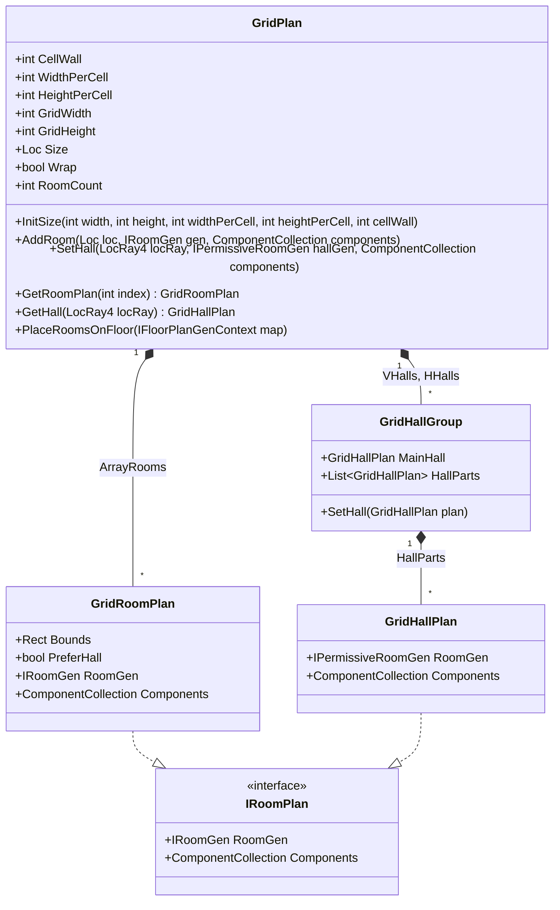
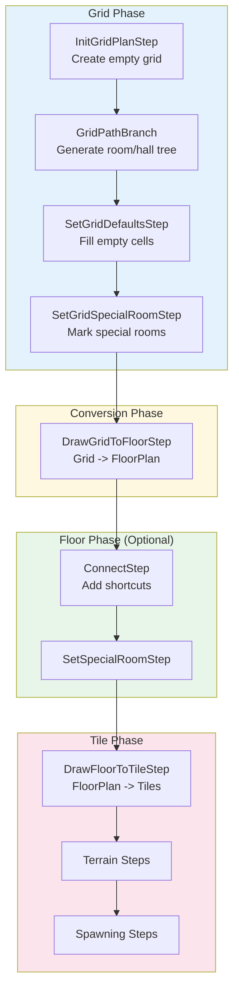

# Grid - Grid-Based Room Layouts

[](https://github.com/audinowho/RogueElements/actions)
[](https://www.nuget.org/packages/RogueElements/)

The Grid system provides **structured room placement** where rooms occupy cells in a rectangular grid and halls connect adjacent cells. This creates classic roguelike dungeon layouts with predictable, uniform structure.

## What is a GridPlan?

A `GridPlan` is a dungeon layout where:
- The map is divided into a **regular grid of cells**
- Each cell can contain **one room**
- **Halls** connect adjacent cells in cardinal directions (up, down, left, right)
- Rooms can span **multiple cells** for larger rooms

```
+-------+-------+-------+
|       |       |       |
| Room  |--Hall-| Room  |
|       |       |       |
+---+---+-------+---+---+
    |               |
   Hall            Hall
    |               |
+---+---+-------+---+---+
|       |       |       |
| Room  |--Hall-| Room  |
|       |       |       |
+-------+-------+-------+
```

## Class Diagram



## Key Classes

### `GridPlan`

The main data structure for grid-based layouts.

```csharp
// From GridPlan.cs
public class GridPlan
{
    // Cell dimensions
    public int CellWall { get; set; }        // Wall thickness between cells (tiles)
    public int WidthPerCell { get; set; }    // Width of each cell (tiles)
    public int HeightPerCell { get; set; }   // Height of each cell (tiles)

    // Grid dimensions
    public int GridWidth => this.Rooms.Length;   // Number of columns
    public int GridHeight => this.Rooms[0].Length; // Number of rows

    // Total size in tiles
    public Loc Size {
        get {
            return new Loc(
                (this.GridWidth * (this.WidthPerCell + this.CellWall)) - (this.Wrap ? 0 : this.CellWall),
                (this.GridHeight * (this.HeightPerCell + this.CellWall)) - (this.Wrap ? 0 : this.CellWall));
        }
    }

    // Initialize the grid
    public void InitSize(int width, int height, int widthPerCell, int heightPerCell, int cellWall = 1, bool wrap = false);

    // Add a room at a grid cell
    public void AddRoom(Loc loc, IRoomGen gen, ComponentCollection components);
    public void AddRoom(Rect rect, IRoomGen gen, ComponentCollection components); // Multi-cell room

    // Set a hall between two adjacent cells
    public void SetHall(LocRay4 locRay, IPermissiveRoomGen hallGen, ComponentCollection components);

    // Convert to FloorPlan for rendering
    public void PlaceRoomsOnFloor(IFloorPlanGenContext map);
}
```

### `GridRoomPlan`

Represents a room within the grid.

```csharp
// From GridRoomPlan.cs
[Serializable]
public class GridRoomPlan : IRoomPlan
{
    public Rect Bounds { get; set; }          // Grid cells occupied (can span multiple)
    public bool PreferHall { get; set; }      // Treat as hall when converting to FloorPlan
    public IRoomGen RoomGen { get; set; }     // Room generator
    public ComponentCollection Components { get; set; }  // Tags/metadata
}
```

### `GridHallPlan`

Represents a hall connecting two cells.

```csharp
// From GridHallPlan.cs
public class GridHallPlan : IRoomPlan
{
    public IPermissiveRoomGen RoomGen { get; }
    public ComponentCollection Components { get; }
}
```

### `GridHallGroup`

Manages hall segments (halls can be split into multiple parts for complex layouts).

```csharp
// From GridHallGroup.cs
public class GridHallGroup
{
    public GridHallPlan MainHall { get; }
    public List<GridHallPlan> HallParts { get; }  // May contain multiple segments
}
```

## Common Steps

### 1. `InitGridPlanStep<T>` - Initialize the Grid

Creates an empty grid with specified dimensions.

```csharp
// From InitGridPlanStep.cs
[Serializable]
public class InitGridPlanStep<T> : GenStep<T>
    where T : class, IRoomGridGenContext
{
    public int CellWidth { get; set; }   // Width of each cell in tiles
    public int CellHeight { get; set; }  // Height of each cell in tiles
    public int CellX { get; set; }       // Number of columns
    public int CellY { get; set; }       // Number of rows
    public int CellWall { get; set; }    // Wall thickness between cells
    public bool Wrap { get; set; }       // Toroidal wrapping

    public override void Apply(T map)
    {
        var floorPlan = new GridPlan();
        floorPlan.InitSize(this.CellX, this.CellY, this.CellWidth, this.CellHeight, this.CellWall, this.Wrap);
        map.InitGrid(floorPlan);
    }
}
```

**Usage:**
```csharp
// Create a 6x4 grid of 9x9 cells with 1-tile walls
var startGen = new InitGridPlanStep<MapGenContext>(1)  // 1 = cellWall
{
    CellX = 6,       // 6 columns
    CellY = 4,       // 4 rows
    CellWidth = 9,   // Each cell is 9 tiles wide
    CellHeight = 9,  // Each cell is 9 tiles tall
};
layout.GenSteps.Add(-4, startGen);
```

### 2. `GridPathBranch<T>` - Generate Branching Paths

Creates a minimum spanning tree of rooms and halls on the grid.

```csharp
// From IGridPathBranch.cs
[Serializable]
public class GridPathBranch<T> : GridPathStartStepGeneric<T>
    where T : class, IRoomGridGenContext
{
    // Percentage of grid cells to fill with rooms
    public RandRange RoomRatio { get; set; }

    // How much the path branches (0=linear, 50=tree, 100+=bushy)
    public RandRange BranchRatio { get; set; }

    // Prevents forced branches even if quota not met
    public bool NoForcedBranches { get; set; }
}
```

**Usage:**
```csharp
var path = new GridPathBranch<MapGenContext>
{
    RoomRatio = new RandRange(70),      // Fill 70% of cells
    BranchRatio = new RandRange(0, 50), // Moderate branching
};
path.GenericRooms = genericRooms;  // Room types to use
path.GenericHalls = genericHalls;  // Hall types to use
layout.GenSteps.Add(-4, path);
```

### 3. `DrawGridToFloorStep<T>` - Convert to FloorPlan

Converts the grid structure into a FloorPlan for further processing or rendering.

```csharp
// From DrawGridToFloorStep.cs
[Serializable]
public class DrawGridToFloorStep<T> : GenStep<T>
    where T : class, IRoomGridGenContext
{
    public override void Apply(T map)
    {
        var floorPlan = new FloorPlan();
        floorPlan.InitSize(map.GridPlan.Size, map.GridPlan.Wrap);
        map.InitPlan(floorPlan);

        // Place all rooms and halls from grid onto floor plan
        map.GridPlan.PlaceRoomsOnFloor(map);
    }
}
```

**Usage:**
```csharp
// Convert grid to floor plan
layout.GenSteps.Add(-2, new DrawGridToFloorStep<MapGenContext>());

// Then render floor plan to tiles
layout.GenSteps.Add(0, new DrawFloorToTileStep<MapGenContext>(1));
```

## Generation Pipeline



## When to Use Grid vs FloorPlan

| Feature | GridPlan | FloorPlan |
|---------|----------|-----------|
| Room placement | Fixed grid cells | Anywhere |
| Room sizes | Constrained by cell | Any size |
| Layout style | Structured, uniform | Organic, irregular |
| Adjacency | Cardinal directions only | Any adjacent rooms |
| Performance | Fast (index-based) | Slower (collision checks) |
| Complexity | Simpler to reason about | More flexible |

**Choose GridPlan when:**
- You want classic roguelike grid aesthetics
- Predictable, structured layouts are desired
- Performance matters (large dungeons)
- You'll convert to FloorPlan for additional processing

**Choose FloorPlan when:**
- Organic, natural-looking layouts are needed
- Rooms should vary significantly in size and position
- Maximum flexibility is required

## Complete Example

From `Ex3_Grid/Example3.cs`:

```csharp
public static void Run()
{
    var layout = new MapGen<MapGenContext>();

    // Step 1: Initialize a 6x4 grid of 9x9 cells
    var startGen = new InitGridPlanStep<MapGenContext>(1)
    {
        CellX = 6,
        CellY = 4,
        CellWidth = 9,
        CellHeight = 9,
    };
    layout.GenSteps.Add(-4, startGen);

    // Step 2: Create branching path of rooms and halls
    var path = new GridPathBranch<MapGenContext>
    {
        RoomRatio = new RandRange(70),
        BranchRatio = new RandRange(0, 50),
    };

    // Define room types
    var genericRooms = new SpawnList<RoomGen<MapGenContext>>
    {
        { new RoomGenSquare<MapGenContext>(new RandRange(4, 8), new RandRange(4, 8)), 10 },
        { new RoomGenRound<MapGenContext>(new RandRange(5, 9), new RandRange(5, 9)), 10 },
    };
    path.GenericRooms = genericRooms;

    // Define hall types
    var genericHalls = new SpawnList<PermissiveRoomGen<MapGenContext>>
    {
        { new RoomGenAngledHall<MapGenContext>(50), 10 }
    };
    path.GenericHalls = genericHalls;

    layout.GenSteps.Add(-4, path);

    // Step 3: Convert grid to floor plan
    layout.GenSteps.Add(-2, new DrawGridToFloorStep<MapGenContext>());

    // Step 4: Render to tiles with 1-tile border
    layout.GenSteps.Add(0, new DrawFloorToTileStep<MapGenContext>(1));

    // Generate!
    MapGenContext context = layout.GenMap(MathUtils.Rand.NextUInt64());
}
```

## Interface Requirements

To use Grid steps, your context must implement `IRoomGridGenContext`:

```csharp
// From IRoomGridGenContext.cs
public interface IRoomGridGenContext : IFloorPlanGenContext
{
    GridPlan GridPlan { get; }
    void InitGrid(GridPlan plan);
}
```

Note that `IRoomGridGenContext` extends `IFloorPlanGenContext`, so Grid contexts can also use FloorPlan steps after conversion.

## Paths/ Subdirectory

The `Paths/` subfolder contains path generation algorithms for grids:

| Class | Description |
|-------|-------------|
| `GridPathStartStep<T>` | Base class for grid path generators |
| `GridPathStartStepGeneric<T>` | Generic version with room/hall pickers |
| `GridPathBranch<T>` | Branching tree path generator |
| `GridPathCross<T>` | Cross-shaped path |
| `GridPathTwoSides<T>` | Rooms on two sides |
| `GridPathSpecific<T>` | Manually specified layout |
| `IGridPathBranch` | Interface for branch-style paths |
| `IGridPathCircle` | Interface for circular paths |
| `IGridPathGrid` | Interface for full grid paths |
| `SpecificGridRoomPlan` | For manually placed rooms |

## Other Steps in This Folder

| Step | Purpose |
|------|---------|
| `ConnectGridBranchStep` | Connect branch endpoints on the grid |
| `SetGridDefaultsStep` | Fill empty cells with default rooms |
| `SetGridPlanComponentStep` | Add components to matching rooms |
| `SetGridSpecialRoomStep` | Mark certain rooms as special |

## Grid Coordinates vs Tile Coordinates

```
Grid (3x2 cells, 5x5 tiles per cell, 1-tile walls):
  Cell(0,0)    Cell(1,0)    Cell(2,0)
     |            |            |
     v            v            v
+-----+--+-----+--+-----+
|     |##|     |##|     |   <- Row 0 cells
|     |##|     |##|     |
|     |##|     |##|     |
|     |##|     |##|     |
|     |##|     |##|     |
+#####++##+#####++##+#####   <- Wall row
+#####++##+#####++##+#####
|     |##|     |##|     |   <- Row 1 cells
|     |##|     |##|     |
|     |##|     |##|     |
|     |##|     |##|     |
|     |##|     |##|     |
+-----+--+-----+--+-----+

Legend:
  ..... = Room space (5x5 tiles)
  ## = Wall between cells (1 tile wide)
```

**Cell bounds calculation:**
```csharp
// From GridPlan.cs
public virtual Rect GetCellBounds(Rect bounds)
{
    return new Rect(
        bounds.X * (this.WidthPerCell + this.CellWall),
        bounds.Y * (this.HeightPerCell + this.CellWall),
        (bounds.Size.X * (this.WidthPerCell + this.CellWall)) - this.CellWall,
        (bounds.Size.Y * (this.HeightPerCell + this.CellWall)) - this.CellWall);
}
```

## See Also

- [MapGen README](../README.md) - Core pipeline documentation
- [FloorPlan README](../FloorPlan/README.md) - Freeform alternative
- [Ex3_Grid](../../../RogueElements.Examples/Ex3_Grid/) - Grid example
