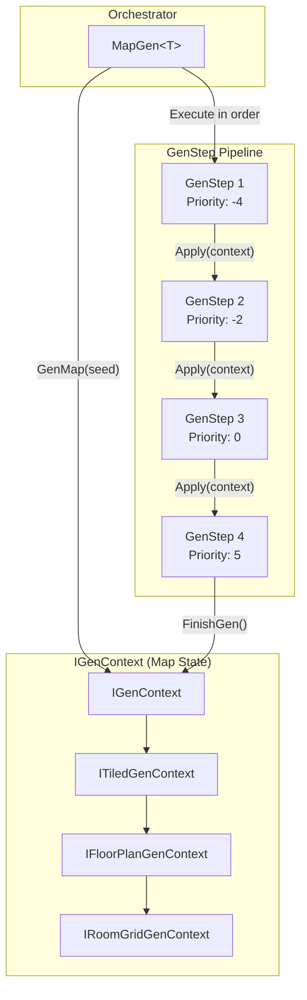
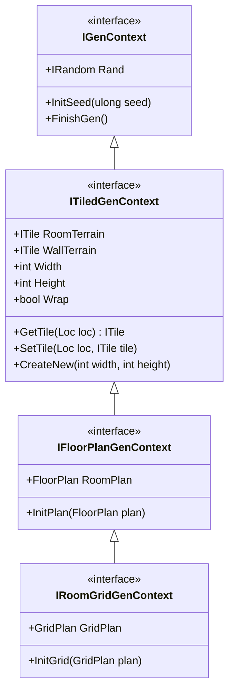
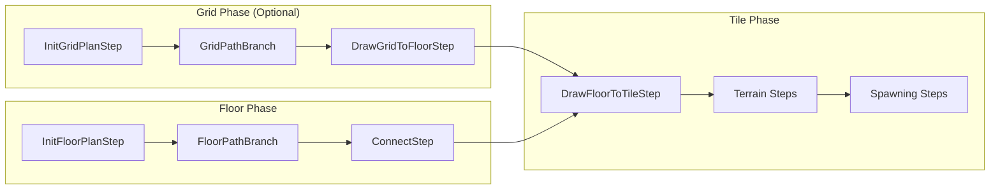

# MapGen - Core Pipeline

[](https://github.com/audinowho/RogueElements/actions)
[](https://www.nuget.org/packages/RogueElements/)
[](https://github.com/audinowho/RogueElements/blob/master/LICENSE)

The MapGen folder contains the core procedural generation pipeline for RogueElements. This pipeline orchestrates the step-by-step construction of roguelike dungeon maps.

## Architecture Overview

RogueElements uses a **pipeline architecture** where `MapGen<T>` orchestrates `GenStep<T>` passes that sequentially modify an `IGenContext`.

```
MapGen.GenMap(seed)
  |
  v
Initialize Context (T) with seed
  |
  v
For each GenStep in priority order:
  |-- GenStep.Apply(context)
  |-- GenStep.Apply(context)
  |-- ...
  v
context.FinishGen()
  |
  v
Return completed map context
```

## Pipeline Flow Diagram



## Core Classes and Interfaces

### `MapGen<T>` - The Orchestrator

The central class that manages the generation pipeline.

```csharp
// From MapGen.cs
public class MapGen<T>
    where T : class, IGenContext
{
    public PriorityList<GenStep<T>> GenSteps { get; }

    public T GenMap(ulong seed)
    {
        T map = (T)Activator.CreateInstance(typeof(T));
        map.InitSeed(seed);

        // Execute all steps in priority order
        StablePriorityQueue<Priority, IGenStep> queue = new StablePriorityQueue<Priority, IGenStep>();
        foreach (Priority priority in this.GenSteps.GetPriorities())
        {
            foreach (IGenStep genStep in this.GenSteps.GetItems(priority))
                queue.Enqueue(priority, genStep);
        }

        ApplyGenSteps(map, queue);
        map.FinishGen();

        return map;
    }
}
```

### `GenStep<T>` - Base Step Class

All generation steps inherit from this abstract class.

```csharp
// From GenStep.cs
public abstract class GenStep<T> : IGenStep
    where T : class, IGenContext
{
    // Override this to implement your generation logic
    public abstract void Apply(T map);

    public bool CanApply(IGenContext context) => context is T;
}
```

### `IGenStep` - Step Interface

The non-generic interface that allows the pipeline to work with any step.

```csharp
// From IGenStep.cs
public interface IGenStep
{
    bool CanApply(IGenContext context);
    void Apply(IGenContext context);
}
```

## Context Interface Hierarchy

The context interfaces form a hierarchy that enables increasingly specialized generation steps:



| Interface | Purpose | Enables |
|-----------|---------|---------|
| `IGenContext` | Base interface with RNG and lifecycle | Basic generation steps |
| `ITiledGenContext` | Tile-based operations | Tile manipulation, terrain, walls |
| `IFloorPlanGenContext` | Freeform room placement | FloorPlan-based room/hall generation |
| `IRoomGridGenContext` | Grid-based room layouts | GridPlan-based structured layouts |

## Creating Custom GenSteps

### Basic Custom Step

```csharp
[Serializable]
public class MyCustomStep<T> : GenStep<T>
    where T : class, ITiledGenContext
{
    public int SomeParameter { get; set; }

    public override void Apply(T map)
    {
        // Use map.Rand for randomness (deterministic based on seed)
        int randomX = map.Rand.Next(map.Width);
        int randomY = map.Rand.Next(map.Height);

        // Modify the map
        map.SetTile(new Loc(randomX, randomY), map.RoomTerrain);
    }
}
```

### Adding Steps to the Pipeline

```csharp
var layout = new MapGen<MyMapGenContext>();

// Steps are ordered by priority (lower = earlier)
layout.GenSteps.Add(-4, new InitGridPlanStep<MyMapGenContext> { ... });
layout.GenSteps.Add(-2, new GridPathBranch<MyMapGenContext> { ... });
layout.GenSteps.Add(-1, new DrawGridToFloorStep<MyMapGenContext>());
layout.GenSteps.Add(0, new DrawFloorToTileStep<MyMapGenContext>(1));

// Generate the map
MyMapGenContext result = layout.GenMap(seed);
```

## Priority System

Steps execute in priority order. Common conventions:

| Priority Range | Typical Usage |
|----------------|---------------|
| -10 to -5 | Plan initialization (InitGridPlanStep, InitFloorPlanStep) |
| -4 to -2 | Path/room generation (GridPathBranch, FloorPathBranch) |
| -1 | Plan-to-plan conversion (DrawGridToFloorStep) |
| 0 | Plan-to-tile conversion (DrawFloorToTileStep) |
| 1 to 10 | Post-processing (terrain, spawning, etc.) |

## Debug Support

The `GenContextDebug` class provides hooks for debugging generation:

```csharp
// From GenContextDebug.cs
public static class GenContextDebug
{
    public static event Action<IGenContext> OnInit;    // Map initialization
    public static event Action<string> OnStep;         // Progress updates
    public static event Action<string> OnStepIn;       // Step entry
    public static event Action OnStepOut;              // Step exit
    public static event Action<Exception> OnError;     // Error handling
}

// Usage
GenContextDebug.OnStepIn += (stepName) => Console.WriteLine($"Starting: {stepName}");
GenContextDebug.OnStep += (msg) => Console.WriteLine($"Progress: {msg}");
```

## Subdirectories

| Directory | Purpose | Documentation |
|-----------|---------|---------------|
| [`FloorPlan/`](./FloorPlan/README.md) | Freeform room-based generation | Rooms placed without grid constraint |
| [`Grid/`](./Grid/README.md) | Grid-based room layouts | Rooms arranged on a regular grid |
| `Rooms/` | Room shape generators | RoomGenSquare, RoomGenCave, etc. |
| `Spawning/` | Entity placement | Items, stairs, mobs |
| `Tiles/` | Tile manipulation | Terrain, water, post-processing |

## Typical Generation Pipeline



## Example: Minimal Pipeline

From `Ex2_Rooms/Example2.cs`:

```csharp
var layout = new MapGen<MapGenContext>();

// 1. Initialize a 54x40 floor plan
InitFloorPlanStep<MapGenContext> startGen = new InitFloorPlanStep<MapGenContext>(54, 40);
layout.GenSteps.Add(-2, startGen);

// 2. Create room and hall types
var genericRooms = new SpawnList<RoomGen<MapGenContext>>
{
    { new RoomGenSquare<MapGenContext>(new RandRange(4, 8), new RandRange(4, 8)), 10 },
    { new RoomGenRound<MapGenContext>(new RandRange(5, 9), new RandRange(5, 9)), 10 },
};

var genericHalls = new SpawnList<PermissiveRoomGen<MapGenContext>>
{
    { new RoomGenAngledHall<MapGenContext>(0, new RandRange(3, 7), new RandRange(3, 7)), 10 },
};

// 3. Generate branching path of rooms and halls
FloorPathBranch<MapGenContext> path = new FloorPathBranch<MapGenContext>(genericRooms, genericHalls)
{
    HallPercent = 50,
    FillPercent = new RandRange(45),
    BranchRatio = new RandRange(0, 25),
};
layout.GenSteps.Add(-1, path);

// 4. Draw rooms to tiles with 1-tile padding
layout.GenSteps.Add(0, new DrawFloorToTileStep<MapGenContext>(1));

// 5. Generate!
MapGenContext context = layout.GenMap(seed);
```

## See Also

- [RogueElements Examples](../../RogueElements.Examples/) - Progressive examples (Ex1-Ex8)
- [FloorPlan README](./FloorPlan/README.md) - Freeform room generation
- [Grid README](./Grid/README.md) - Grid-based layouts
