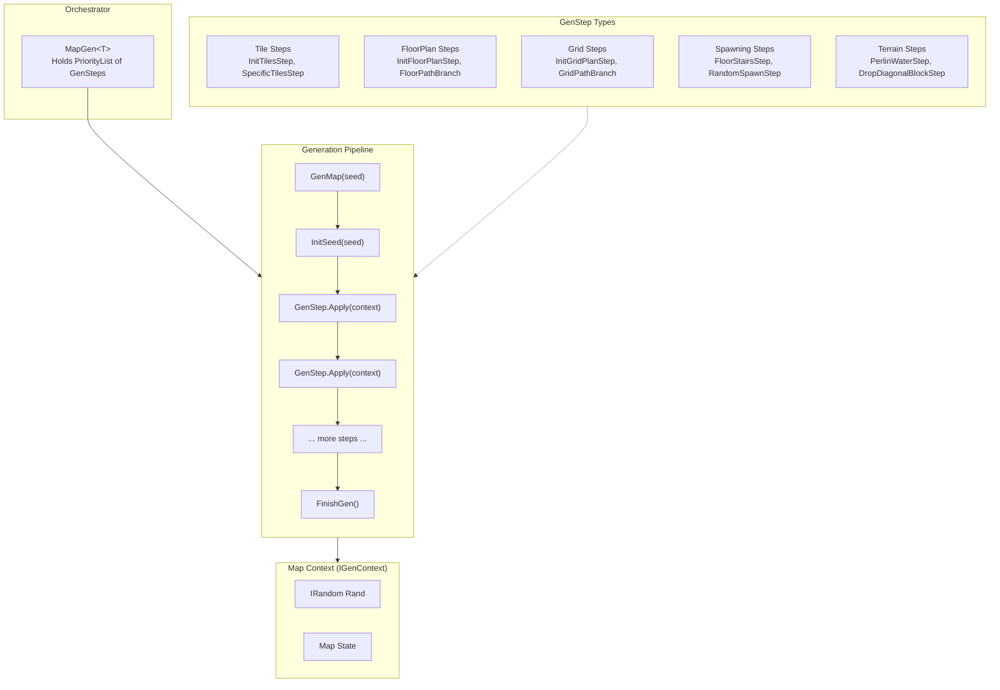

# RogueElements

[](https://www.nuget.org/packages/RogueElements/)
[](https://opensource.org/licenses/MIT)
[](https://docs.microsoft.com/en-us/dotnet/standard/net-standard)

The core library for procedural roguelike map generation using a pipeline architecture. This library is game-agnostic and designed to be integrated into any roguelike or procedural generation project.

## Overview

RogueElements provides a flexible, composable system for generating dungeon-like maps. The architecture follows a pipeline pattern where a `MapGen<T>` orchestrator executes a prioritized sequence of `GenStep<T>` operations that progressively build up map state in an `IGenContext`.

## Architecture



### Core Abstractions

| Class/Interface | Purpose |
|-----------------|---------|
| `MapGen<T>` | Orchestrator - holds priority-ordered GenSteps, calls `GenMap(seed)` |
| `GenStep<T>` | Base class for generation passes - implement `Apply(T map)` |
| `IGenContext` | Base interface for map state - provides `Rand`, `InitSeed()`, `FinishGen()` |
| `Priority` | Ordering mechanism for GenSteps (lower values = earlier execution) |
| `PriorityList<T>` | Container holding GenSteps organized by Priority |

### Context Interfaces

The library uses interface composition to enable specific capabilities. Implement the interfaces your GenSteps require:

| Interface | Enables | Key Members |
|-----------|---------|-------------|
| `ITiledGenContext` | Tile-based operations | `GetTile()`, `SetTile()`, `TileBlocked()` |
| `IFloorPlanGenContext` | Freeform room placement | `FloorPlan` property |
| `IRoomGridGenContext` | Grid-based room layouts | `GridPlan` property |
| `IPlaceableGenContext<T>` | Spawning entities | `PlaceItem()`, spawn location queries |

## Directory Structure

```
RogueElements/
├── MapGen/                    # Generation pipeline
│   ├── MapGen.cs             # Main orchestrator
│   ├── GenStep.cs            # Base step class
│   ├── IGenContext.cs        # Core context interface
│   ├── FloorPlan/            # Freeform room-based generation
│   │   ├── FloorPlan.cs      # Room/hall container
│   │   ├── FloorPathBranch.cs # Branching path algorithm
│   │   └── Paths/            # Path generation strategies
│   ├── Grid/                 # Grid-based room layouts
│   │   ├── GridPlan.cs       # Grid cell container
│   │   ├── GridPathBranch.cs # Grid branching algorithm
│   │   └── Paths/            # Grid path strategies
│   ├── Rooms/                # Room shape generators
│   │   ├── RoomGenSquare.cs  # Rectangular rooms
│   │   ├── RoomGenRound.cs   # Circular/elliptical rooms
│   │   ├── RoomGenCave.cs    # Organic cave shapes
│   │   └── Halls/            # Hall connectors
│   ├── Spawning/             # Entity placement
│   │   ├── RandomSpawnStep.cs    # Random item/mob placement
│   │   ├── FloorStairsStep.cs    # Stair placement
│   │   └── RoomSpawnStep.cs      # Room-based spawning
│   └── Tiles/                # Tile manipulation
│       ├── InitTilesStep.cs  # Initialize tile grid
│       ├── Water/            # Water/terrain generation
│       └── PerlinWaterStep.cs # Noise-based terrain
├── Rand/                     # RNG utilities
│   ├── RandRange.cs          # Random integer ranges
│   ├── SpawnList.cs          # Weighted random selection
│   ├── RNG/                  # Random number generators
│   └── Noise/                # Perlin noise utilities
├── Priority/                 # Priority queue system
│   ├── Priority.cs           # Priority value type
│   └── PriorityList.cs       # Ordered collection
├── Loc.cs                    # 2D coordinate struct
├── Rect.cs                   # Rectangle operations
├── Grid.cs                   # Grid utilities (pathfinding, flood fill)
└── Detection.cs              # Shape detection algorithms
```

## Quick Start

### 1. Create a Map Context

Your map context implements the interfaces your GenSteps need:

```csharp
public class MyMapContext : IGenContext, ITiledGenContext
{
    private Tile[,] tiles;
    public IRandom Rand { get; private set; }

    public void InitSeed(ulong seed) => Rand = new ReRandom(seed);
    public void FinishGen() { }

    // ITiledGenContext implementation
    public ITile RoomTerrain => new Tile(1);
    public ITile WallTerrain => new Tile(0);
    public int Width => tiles.GetLength(0);
    public int Height => tiles.GetLength(1);
    public bool Wrap => false;

    public void CreateNew(int width, int height, bool wrap = false)
    {
        tiles = new Tile[width, height];
    }

    public ITile GetTile(Loc loc) => tiles[loc.X, loc.Y];
    public bool TrySetTile(Loc loc, ITile tile)
    {
        tiles[loc.X, loc.Y] = (Tile)tile;
        return true;
    }
    // ... other members
}
```

### 2. Build a Generation Pipeline

```csharp
var layout = new MapGen<MyMapContext>();

// Priority determines execution order (lower = earlier)
// Step 1: Initialize a 50x50 tile grid
layout.GenSteps.Add(-4, new InitTilesStep<MyMapContext>(50, 50));

// Step 2: Set up grid-based room layout
var gridInit = new InitGridPlanStep<MyMapContext>(1)
{
    CellX = 5,
    CellY = 4,
    CellWidth = 9,
    CellHeight = 9
};
layout.GenSteps.Add(-3, gridInit);

// Step 3: Generate branching room path
var path = new GridPathBranch<MyMapContext>
{
    RoomRatio = new RandRange(70),
    BranchRatio = new RandRange(0, 50),
    GenericRooms = new SpawnList<RoomGen<MyMapContext>>
    {
        { new RoomGenSquare<MyMapContext>(new RandRange(4, 8), new RandRange(4, 8)), 10 },
        { new RoomGenRound<MyMapContext>(new RandRange(5, 9), new RandRange(5, 9)), 10 }
    }
};
layout.GenSteps.Add(-2, path);

// Step 4: Convert grid to floor plan
layout.GenSteps.Add(-1, new DrawGridToFloorStep<MyMapContext>());

// Step 5: Draw to tiles
layout.GenSteps.Add(0, new DrawFloorToTileStep<MyMapContext>(1));

// Generate!
MyMapContext map = layout.GenMap(seed);
```

### 3. Create Custom GenSteps

```csharp
[Serializable]
public class MyCustomStep : GenStep<ITiledGenContext>
{
    public int Parameter { get; set; }

    public override void Apply(ITiledGenContext map)
    {
        // Use map.Rand for randomness
        int x = map.Rand.Next(map.Width);
        int y = map.Rand.Next(map.Height);

        // Modify map state
        map.SetTile(new Loc(x, y), map.RoomTerrain);
    }
}

// Add to pipeline
layout.GenSteps.Add(5, new MyCustomStep { Parameter = 42 });
```

## Key Patterns

### Priority-Based Ordering

GenSteps execute in priority order. Use negative priorities for setup, zero for main generation, positive for post-processing:

```
-4: Grid/FloorPlan initialization
-2: Room path generation
 0: Tile drawing
 2: Stair placement
 3: Terrain (water, lava)
 6: Item/mob spawning
```

### Generic Constraints

GenSteps use generic constraints to declare their context requirements:

```csharp
// Requires only basic context
public class BasicStep : GenStep<IGenContext> { }

// Requires tile support
public class TileStep : GenStep<ITiledGenContext> { }

// Requires multiple capabilities
public class SpawnStep<T> : GenStep<T>
    where T : IFloorPlanGenContext, IPlaceableGenContext<Item> { }
```

### Serialization

All GenSteps are marked `[Serializable]` for save/load support. Your context should also be serializable if you need to save generation state.

## Debug Support

Hook into the generation process for debugging:

```csharp
GenContextDebug.OnInit += (context) => Console.WriteLine("Map initialized");
GenContextDebug.OnStepIn += (stepName) => Console.WriteLine($"Starting: {stepName}");
GenContextDebug.OnStepOut += () => Console.WriteLine("Step complete");
GenContextDebug.OnStep += (context) => RenderMap(context);
```

## See Also

- **[RogueElements.Examples](../RogueElements.Examples/)** - 8 progressive examples demonstrating library usage
- **[RogueElements.Tests](../RogueElements.Tests/)** - Unit tests showing expected behavior
- **[CLAUDE.md](../CLAUDE.md)** - Full architecture documentation

---


