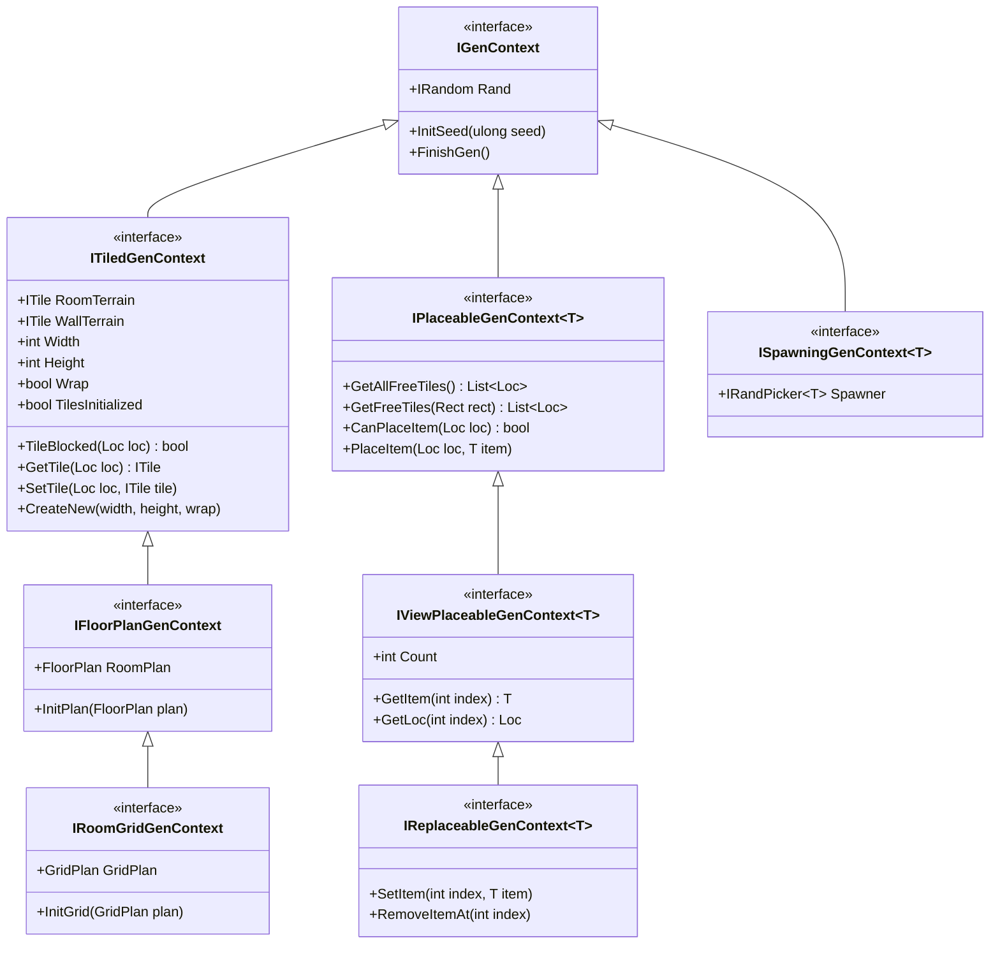

# RogueElements Architecture Reference

> Claude Code-optimized reference for the RogueElements procedural generation library.

---

## Interface Hierarchy



---

## Interface Capabilities Table

| Interface | Inherits From | Adds |
|-----------|---------------|------|
| `IGenContext` | - | `Rand`, `InitSeed()`, `FinishGen()` |
| `ITiledGenContext` | `IGenContext` | Tile access (`GetTile`, `SetTile`, `CreateNew`), terrain types, dimensions |
| `IFloorPlanGenContext` | `ITiledGenContext` | `FloorPlan RoomPlan`, `InitPlan()` for freeform room layouts |
| `IRoomGridGenContext` | `IFloorPlanGenContext` | `GridPlan GridPlan`, `InitGrid()` for grid-based room layouts |
| `IPlaceableGenContext<T>` | `IGenContext` | Entity placement (`PlaceItem`, `GetFreeTiles`, `CanPlaceItem`) |
| `IViewPlaceableGenContext<T>` | `IPlaceableGenContext<T>` | Read access to placed items (`Count`, `GetItem`, `GetLoc`) |
| `IReplaceableGenContext<T>` | `IViewPlaceableGenContext<T>` | Modify/remove placed items (`SetItem`, `RemoveItemAt`) |
| `ISpawningGenContext<T>` | `IGenContext` | Context-provided spawn tables via `IRandPicker<T> Spawner` |

---

## GenStep Categories

### By Required Context Interface

| Category | Base Class | Context Constraint | Purpose |
|----------|------------|-------------------|---------|
| **Core** | `GenStep<T>` | `IGenContext` | Base class for all steps |
| **Tile** | `GenStep<T>` | `ITiledGenContext` | Direct tile manipulation |
| **Water/Terrain** | `WaterStep<T>` | `ITiledGenContext` | Terrain placement with stencils |
| **FloorPlan** | `FloorPlanStep<T>` | `IFloorPlanGenContext` | Room/hall layout operations |
| **GridPlan** | `GridPlanStep<T>` | `IRoomGridGenContext` | Grid-based room operations |
| **Spawning** | `BaseSpawnStep<T,S>` | `IPlaceableGenContext<S>` | Entity placement strategies |
| **Stairs** | `BaseFloorStairsStep<T,E,X>` | `IFloorPlanGenContext` + `IPlaceableGenContext` | Stair placement |

### Concrete Step Examples

| Step | Category | Description |
|------|----------|-------------|
| `InitTilesStep<T>` | Tile | Creates empty tile map with dimensions |
| `SpecificTilesStep<T>` | Tile | Places tiles at specific locations |
| `StairsStep<T,E,X>` | Tile | Places stairs without floor plan |
| `BlobWaterStep<T>` | Water | Places random blob-shaped terrain |
| `PerlinWaterStep<T>` | Water | Places terrain using Perlin noise |
| `InitFloorPlanStep<T>` | FloorPlan | Initializes empty floor plan |
| `DrawFloorToTileStep<T>` | FloorPlan | Converts floor plan to tiles |
| `AddConnectedRoomsStep<T>` | FloorPlan | Adds connected rooms to plan |
| `ConnectStep<T>` | FloorPlan | Connects disconnected rooms |
| `SetSpecialRoomStep<T>` | FloorPlan | Marks rooms as special |
| `InitGridPlanStep<T>` | GridPlan | Initializes grid layout |
| `DrawGridToFloorStep<T>` | GridPlan | Converts grid to floor plan |
| `GridPathStartStep<T>` | GridPlan | Creates room paths on grid |
| `SetGridDefaultsStep<T>` | GridPlan | Sets default room/hall generators |
| `RandomSpawnStep<T,S>` | Spawning | Random entity placement |
| `RoomSpawnStep<T,S>` | Spawning | Per-room entity placement |
| `TerminalSpawnStep<T,S>` | Spawning | Place at dead-end rooms |
| `TerrainSpawnStep<T,S>` | Spawning | Place on specific terrain |

---

## Data Flow

```mermaid
flowchart LR
    subgraph GridPhase["Grid Phase"]
        IG[InitGridPlanStep]
        GP[GridPathStep]
        GD[SetGridDefaultsStep]
    end

    subgraph ConvertGrid["Convert"]
        DGF[DrawGridToFloorStep]
    end

    subgraph FloorPhase["Floor Phase"]
        IF[InitFloorPlanStep]
        AR[AddRoomsStep]
        CS[ConnectStep]
    end

    subgraph ConvertFloor["Convert"]
        DFT[DrawFloorToTileStep]
    end

    subgraph TilePhase["Tile Phase"]
        IT[InitTilesStep]
        WS[WaterStep]
        SS[StairsStep]
    end

    subgraph SpawnPhase["Spawn Phase"]
        RS[RandomSpawnStep]
        TS[TerminalSpawnStep]
    end

    IG --> GP --> GD --> DGF
    DGF --> FloorPhase
    IF --> AR --> CS --> DFT
    DFT --> TilePhase
    IT --> WS --> SS --> SpawnPhase

    style DGF fill:#f9f,stroke:#333
    style DFT fill:#f9f,stroke:#333
```



### Conversion Steps (Critical)

| Step | Input | Output | Notes |
|------|-------|--------|-------|
| `DrawGridToFloorStep<T>` | `GridPlan` | `FloorPlan` | Converts grid cells to room bounds |
| `DrawFloorToTileStep<T>` | `FloorPlan` | Tiles | Renders rooms/halls to tile array |

---

## Key Classes Quick Reference

| Class | Purpose |
|-------|---------|
| `MapGen<T>` | Orchestrator - holds GenSteps, calls `GenMap(seed)` |
| `GenStep<T>` | Base class for generation passes - implement `Apply(T map)` |
| `Priority` | Ordering mechanism (lower = earlier) |
| `PriorityList<T>` | Priority-ordered collection for GenSteps |
| `FloorPlan` | Freeform room/hall layout container |
| `GridPlan` | Grid-based room layout container |
| `IRoomGen` | Interface for room shape generators |
| `IPermissiveRoomGen` | Room generator that can fit variable bounds |
| `ISpawnable` | Marker interface for placeable entities |
| `IStepSpawner<T,S>` | Generates spawn lists for BaseSpawnStep |
| `IRandPicker<T>` | Weighted random selection interface |
| `SpawnList<T>` | Weighted spawn table implementation |
| `ITerrainStencil<T>` | Filters tiles for terrain placement |

---

## Pipeline Execution Order

```
1. MapGen.GenMap(seed)
   |
   +-- Create context via Activator.CreateInstance<T>()
   +-- context.InitSeed(seed)
   +-- GenContextDebug.DebugInit()
   |
   +-- For each GenStep in priority order:
   |     +-- GenContextDebug.StepIn()
   |     +-- step.Apply(context)
   |     +-- GenContextDebug.StepOut()
   |
   +-- context.FinishGen()
   +-- Return context
```

---

## Common Patterns

### Typical Grid-Based Pipeline

```
Priority 1:  InitGridPlanStep       (create grid)
Priority 2:  GridPathBranchStep     (create room path)
Priority 3:  SetGridDefaultsStep    (assign room generators)
Priority 4:  DrawGridToFloorStep    (grid -> floor plan)
Priority 5:  DrawFloorToTileStep    (floor plan -> tiles)
Priority 6:  WaterStep              (add terrain)
Priority 7:  StairsStep             (add entrances/exits)
Priority 8:  RandomSpawnStep        (add items/mobs)
```

### Typical FloorPlan-Based Pipeline

```
Priority 1:  InitFloorPlanStep      (create empty plan)
Priority 2:  AddConnectedRoomsStep  (add rooms)
Priority 3:  ConnectBranchStep      (connect rooms)
Priority 4:  DrawFloorToTileStep    (floor plan -> tiles)
Priority 5:  StairsStep             (add entrances/exits)
Priority 6:  RandomSpawnStep        (add items/mobs)
```

---

## File Locations

| Component | Path |
|-----------|------|
| Core interfaces | `RogueElements/MapGen/IGenContext.cs` |
| Tile context | `RogueElements/MapGen/Tiles/ITiledGenContext.cs` |
| FloorPlan context | `RogueElements/MapGen/FloorPlan/IFloorPlanGenContext.cs` |
| Grid context | `RogueElements/MapGen/Grid/IRoomGridGenContext.cs` |
| Spawn contexts | `RogueElements/MapGen/Spawning/I*GenContext.cs` |
| MapGen orchestrator | `RogueElements/MapGen/MapGen.cs` |
| GenStep base | `RogueElements/MapGen/GenStep.cs` |
| FloorPlanStep base | `RogueElements/MapGen/FloorPlan/FloorPlanStep.cs` |
| GridPlanStep base | `RogueElements/MapGen/Grid/GridPlanStep.cs` |
| BaseSpawnStep base | `RogueElements/MapGen/Spawning/IBaseSpawnStep.cs` |
| WaterStep base | `RogueElements/MapGen/Tiles/Water/WaterStep.cs` |
