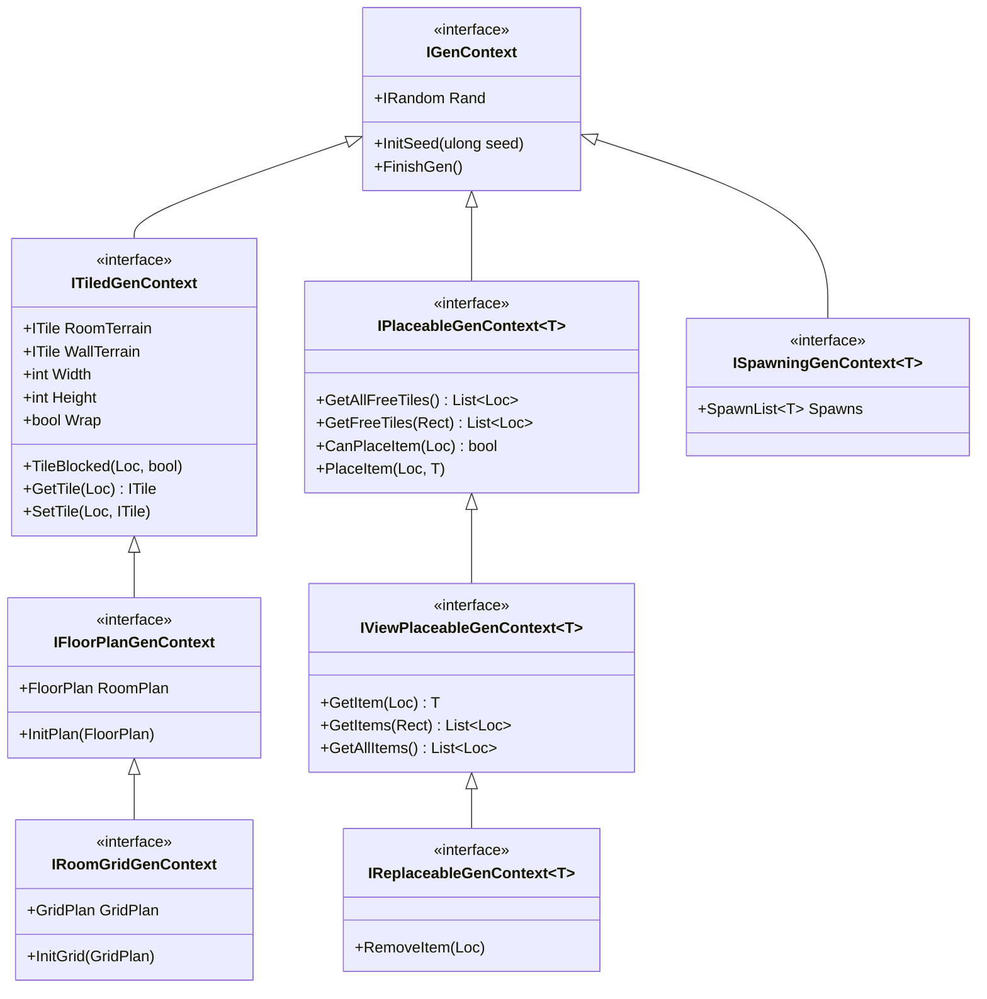
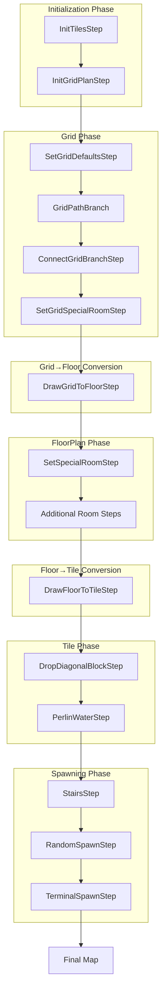

# RogueElements Architecture Reference

> Claude Code-optimized reference. Tables, diagrams, minimal prose.

## Interface Hierarchy



## Interface Capabilities

| Interface | Key Members | Purpose |
|-----------|-------------|---------|
| `IGenContext` | `Rand`, `InitSeed()`, `FinishGen()` | Base context with RNG |
| `ITiledGenContext` | `Width`, `Height`, `GetTile()`, `SetTile()`, `TileBlocked()` | Tile-based map operations |
| `IFloorPlanGenContext` | `RoomPlan`, `InitPlan()` | Freeform room placement |
| `IRoomGridGenContext` | `GridPlan`, `InitGrid()` | Grid-based room layouts |
| `IPlaceableGenContext<T>` | `GetFreeTiles()`, `CanPlaceItem()`, `PlaceItem()` | Entity spawning |
| `IViewPlaceableGenContext<T>` | `GetItem()`, `GetItems()`, `GetAllItems()` | Read placed entities |
| `IReplaceableGenContext<T>` | `RemoveItem()` | Remove/replace entities |
| `ISpawningGenContext<T>` | `Spawns` | Weighted spawn lists |

## Interface Inheritance Chain

```
IGenContext
    │
    ├── ITiledGenContext          (adds tile operations)
    │       │
    │       └── IFloorPlanGenContext    (adds FloorPlan)
    │               │
    │               └── IRoomGridGenContext   (adds GridPlan)
    │
    ├── IPlaceableGenContext<T>   (adds entity placement)
    │       │
    │       └── IViewPlaceableGenContext<T>  (adds read access)
    │               │
    │               └── IReplaceableGenContext<T>  (adds removal)
    │
    └── ISpawningGenContext<T>    (adds spawn lists)
```

## GenStep Categories

### Initialization Steps

| Step | Required Context | Purpose |
|------|------------------|---------|
| `InitTilesStep<T>` | `ITiledGenContext` | Initialize tile array with dimensions |
| `InitGridPlanStep<T>` | `IRoomGridGenContext` | Create empty GridPlan |
| `InitFloorPlanStep<T>` | `IFloorPlanGenContext` | Create empty FloorPlan |

### Grid Steps

| Step | Required Context | Purpose |
|------|------------------|---------|
| `SetGridDefaultsStep<T>` | `IRoomGridGenContext` | Set default room/hall generators |
| `GridPathBranch<T>` | `IRoomGridGenContext` | Create branching paths in grid |
| `GridPathCircle<T>` | `IRoomGridGenContext` | Create circular path in grid |
| `GridPathTwoSides<T>` | `IRoomGridGenContext` | Connect two sides of grid |
| `ConnectGridBranchStep<T>` | `IRoomGridGenContext` | Add extra connections |
| `SetGridSpecialRoomStep<T>` | `IRoomGridGenContext` | Place special rooms in grid |

### Conversion Steps

| Step | Required Context | Purpose |
|------|------------------|---------|
| `DrawGridToFloorStep<T>` | `IRoomGridGenContext` | GridPlan → FloorPlan |
| `DrawFloorToTileStep<T>` | `IFloorPlanGenContext` | FloorPlan → Tiles |

### FloorPlan Steps

| Step | Required Context | Purpose |
|------|------------------|---------|
| `AddConnectedRoomsStep<T>` | `IFloorPlanGenContext` | Add rooms with hallway connections |
| `FloorPathBranch<T>` | `IFloorPlanGenContext` | Create branching room paths |
| `SetSpecialRoomStep<T>` | `IFloorPlanGenContext` | Place special rooms |
| `AddBossRoomStep<T>` | `IFloorPlanGenContext` | Add boss room at dead end |

### Tile Steps

| Step | Required Context | Purpose |
|------|------------------|---------|
| `SpecificTilesStep<T>` | `ITiledGenContext` | Place specific tiles at locations |
| `StairsStep<T>` | `ITiledGenContext` + `IPlaceableGenContext<T>` | Place stairs |
| `DropDiagonalBlockStep<T>` | `ITiledGenContext` | Remove diagonal wall blocks |
| `FloorStairsStep<T>` | `IFloorPlanGenContext` + `IPlaceableGenContext<T>` | Stairs using room info |

### Water/Terrain Steps

| Step | Required Context | Purpose |
|------|------------------|---------|
| `PerlinWaterStep<T>` | `ITiledGenContext` | Perlin noise water generation |
| `BlobWaterStep<T>` | `ITiledGenContext` | Blob-based water generation |

### Spawning Steps

| Step | Required Context | Purpose |
|------|------------------|---------|
| `RandomSpawnStep<T, E>` | `IPlaceableGenContext<E>` | Random entity placement |
| `TerminalSpawnStep<T, E>` | `IFloorPlanGenContext` + `IPlaceableGenContext<E>` | Spawn at dead ends |
| `RoomSpawnStep<T, E>` | `IFloorPlanGenContext` + `IPlaceableGenContext<E>` | Per-room spawning |
| `PickerSpawner<T, E>` | `ISpawningGenContext<E>` + `IPlaceableGenContext<E>` | Spawn from weighted list |

## Data Flow Pipeline



## Data Structures

### GridPlan

| Member | Type | Purpose |
|--------|------|---------|
| `GridWidth` | `int` | Number of room columns |
| `GridHeight` | `int` | Number of room rows |
| `CellWall` | `int` | Wall thickness between cells |
| `WidthRange` | `RandRange` | Room width range |
| `HeightRange` | `RandRange` | Room height range |
| `GetRoom(Loc)` | `GridRoomPlan` | Get room at grid position |
| `GetHall(LocRay4)` | `GridHallPlan` | Get hallway between rooms |

### FloorPlan

| Member | Type | Purpose |
|--------|------|---------|
| `RoomCount` | `int` | Number of rooms |
| `HallCount` | `int` | Number of hallways |
| `GetRoom(int)` | `IRoomPlan` | Get room by index |
| `GetHall(int)` | `IPermissiveRoomGen` | Get hall by index |
| `GetRoomHall(RoomHallIndex)` | `IRoomPlan` | Get room or hall |
| `AddRoom(IRoomGen, ...)` | `void` | Add room to plan |
| `AddHall(IPermissiveRoomGen, ...)` | `void` | Add hallway to plan |

### RoomGen Types

| Type | Purpose |
|------|---------|
| `RoomGenSquare<T>` | Rectangular rooms |
| `RoomGenRound<T>` | Circular/elliptical rooms |
| `RoomGenCave<T>` | Cave-like irregular rooms |
| `RoomGenCross<T>` | Cross-shaped rooms |
| `RoomGenAngledHall<T>` | Angled hallway connections |
| `RoomGenDefault<T>` | Default fallback generator |

## Key Classes Quick Reference

| Class | File | Purpose |
|-------|------|---------|
| `MapGen<T>` | `MapGen/MapGen.cs` | Main orchestrator |
| `GenStep<T>` | `MapGen/GenStep.cs` | Base step class |
| `Priority` | `Priority/Priority.cs` | Step ordering |
| `PriorityList<T>` | `Priority/PriorityList.cs` | Ordered step container |
| `FloorPlan` | `MapGen/FloorPlan/FloorPlan.cs` | Freeform room layout |
| `GridPlan` | `MapGen/Grid/GridPlan.cs` | Grid-based layout |
| `SpawnList<T>` | `Rand/SpawnList.cs` | Weighted random selection |
| `RandRange` | `Rand/RandRange.cs` | Random range values |

## File Locations

| Component | Path |
|-----------|------|
| Core Pipeline | `RogueElements/MapGen/` |
| Context Interfaces | `RogueElements/MapGen/IGenContext.cs`, `ITiledGenContext.cs`, etc. |
| GenStep Base | `RogueElements/MapGen/GenStep.cs` |
| FloorPlan System | `RogueElements/MapGen/FloorPlan/` |
| Grid System | `RogueElements/MapGen/Grid/` |
| Room Generators | `RogueElements/MapGen/Rooms/` |
| Spawning System | `RogueElements/MapGen/Spawning/` |
| Tile Operations | `RogueElements/MapGen/Tiles/` |
| RNG Utilities | `RogueElements/Rand/` |
| Priority System | `RogueElements/Priority/` |
| Examples | `RogueElements.Examples/` |
| Tests | `RogueElements.Tests/` |

## Priority Conventions

| Range | Phase | Example Steps |
|-------|-------|---------------|
| -10 to -1 | Pre-init | Debug setup |
| 0-9 | Initialization | `InitTilesStep`, `InitGridPlanStep` |
| 10-19 | Grid Setup | `SetGridDefaultsStep`, `GridPathBranch` |
| 20-29 | Grid Connections | `ConnectGridBranchStep` |
| 30-39 | Grid→Floor | `DrawGridToFloorStep` |
| 40-49 | Floor Modifications | `SetSpecialRoomStep` |
| 50-59 | Floor→Tile | `DrawFloorToTileStep` |
| 60-69 | Tile Cleanup | `DropDiagonalBlockStep` |
| 70-79 | Terrain | `PerlinWaterStep` |
| 80-89 | Stairs | `StairsStep` |
| 90-99 | Spawning | `RandomSpawnStep`, `TerminalSpawnStep` |

## Context Constraint Patterns

```csharp
// Minimal - only needs RNG
public class MyStep<T> : GenStep<T> where T : IGenContext

// Tile operations
public class MyStep<T> : GenStep<T> where T : ITiledGenContext

// Room-aware operations
public class MyStep<T> : GenStep<T> where T : IFloorPlanGenContext

// Grid-based generation
public class MyStep<T> : GenStep<T> where T : IRoomGridGenContext

// Entity spawning
public class MyStep<T, E> : GenStep<T> where T : IPlaceableGenContext<E>

// Multiple constraints
public class MyStep<T> : GenStep<T>
    where T : IFloorPlanGenContext, IPlaceableGenContext<StairsUp>
```

## Debug Hooks

| Event | Signature | When Fired |
|-------|-----------|------------|
| `GenContextDebug.OnInit` | `Action<IGenContext>` | Map initialization |
| `GenContextDebug.OnStep` | `Action<IGenContext, GenStep>` | Each step execution |
| `GenContextDebug.OnStepIn` | `Action<IGenContext, GenStep>` | Step entry |
| `GenContextDebug.OnStepOut` | `Action<IGenContext, GenStep>` | Step exit |
