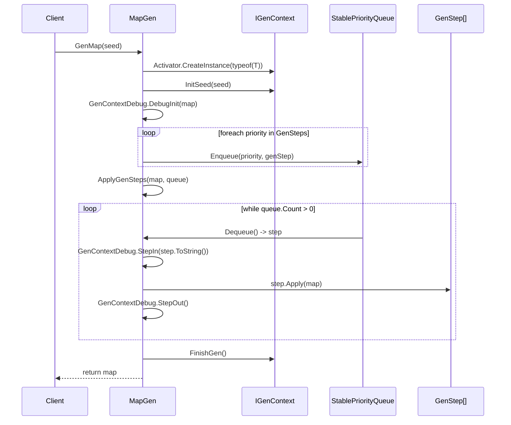
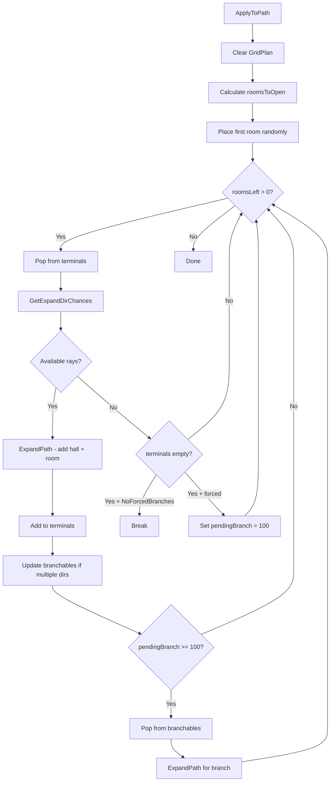
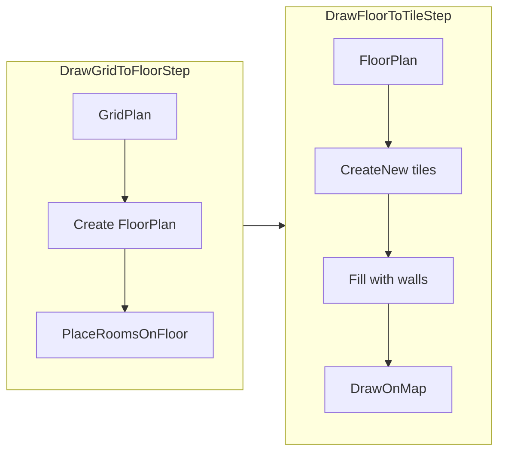
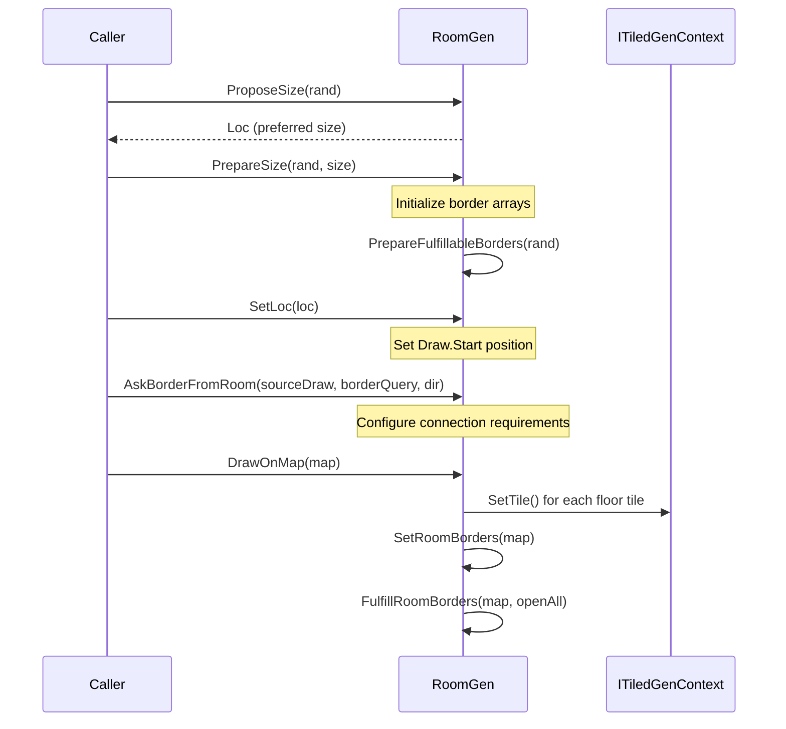
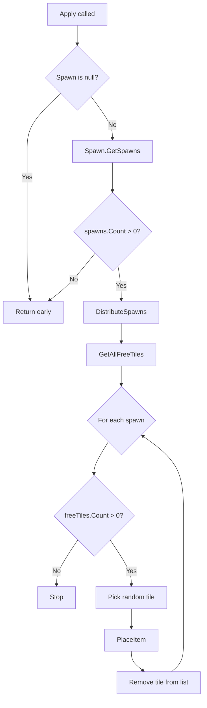

# Code Flow Documentation

Traced execution paths for key operations in RogueElements.

## 1. MapGen.GenMap(seed) Flow

The main entry point for generating a map.

**File:** `RogueElements/MapGen/MapGen.cs`



### Key Code Points

| Location | Description |
|----------|-------------|
| `MapGen.cs:126` | Context created via `Activator.CreateInstance(typeof(T))` |
| `MapGen.cs:127` | `map.InitSeed(seed)` initializes RNG |
| `MapGen.cs:129` | `GenContextDebug.DebugInit(map)` fires OnInit event |
| `MapGen.cs:132-137` | Priority queue built from GenSteps |
| `MapGen.cs:139` | `ApplyGenSteps(map, queue)` executes the pipeline |
| `MapGen.cs:141` | `map.FinishGen()` called after all steps |

### ApplyGenSteps Loop (lines 164-182)

```csharp
while (queue.Count > 0)
{
    IGenStep postProc = queue.Dequeue();      // line 168
    GenContextDebug.StepIn(postProc.ToString()); // line 169
    try
    {
        postProc.Apply(map);                   // line 173
    }
    catch (Exception ex)
    {
        GenContextDebug.DebugError(ex);        // line 177
    }
    GenContextDebug.StepOut();                 // line 180
}
```

---

## 2. Grid-Based Room Generation (GridPathBranch)

Tree-like layout using terminals/branchables pattern.

**File:** `RogueElements/MapGen/Grid/Paths/IGridPathBranch.cs`



### Key Methods

**ApplyToPath** (`IGridPathBranch.cs:111-205`)

```csharp
public override void ApplyToPath(IRandom rand, GridPlan floorPlan)
{
    // Retry loop for failed attempts
    for (int ii = 0; ii < 10; ii++)                           // line 113
    {
        floorPlan.Clear();                                     // line 116

        int roomsToOpen = floorPlan.GridWidth * floorPlan.GridHeight
                          * this.RoomRatio.Pick(rand) / 100;   // line 118

        // Place first room randomly
        Loc sourceRoom = new Loc(
            rand.Next(floorPlan.GridWidth),
            rand.Next(floorPlan.GridHeight));                  // line 128
        floorPlan.AddRoom(sourceRoom, this.GenericRooms.Pick(rand),
                          this.RoomComponents.Clone());        // line 129

        // Add to terminals twice (can expand in 2 directions)
        terminals.Add(sourceRoom);                             // line 132
        terminals.Add(sourceRoom);                             // line 133
        // ... expansion loop
    }
}
```

**ExpandPath** (`IGridPathBranch.cs:250-257`)

```csharp
protected bool ExpandPath(IRandom rand, GridPlan floorPlan, LocRay4 chosenRay)
{
    floorPlan.SetHall(chosenRay, this.GenericHalls.Pick(rand),
                      this.HallComponents.Clone());            // line 252
    floorPlan.AddRoom(chosenRay.Traverse(1),
                      this.GenericRooms.Pick(rand),
                      this.RoomComponents.Clone());            // line 253
    return true;
}
```

### Decision Points

| Line | Decision |
|------|----------|
| 118-120 | `roomsToOpen` capped to minimum 1 |
| 147-163 | If rays available, extend path; else check terminals empty |
| 167-170 | `NoForcedBranches` controls whether to break or force branch |
| 173-196 | Branch loop runs while `pendingBranch >= 100` |

---

## 3. GridPlan to FloorPlan to Tiles Conversion

Three-stage transformation pipeline.



### Stage 1: DrawGridToFloorStep

**File:** `RogueElements/MapGen/Grid/DrawGridToFloorStep.cs`

```csharp
public override void Apply(T map)                              // line 45
{
    var floorPlan = new FloorPlan();                          // line 47
    floorPlan.InitSize(map.GridPlan.Size, map.GridPlan.Wrap); // line 48
    map.InitPlan(floorPlan);                                  // line 49
    map.GridPlan.PlaceRoomsOnFloor(map);                      // line 51
}
```

**PlaceRoomsOnFloor** (`GridPlan.cs:206-329`)

1. **Choose room bounds** (lines 209-210):
   ```csharp
   for (int ii = 0; ii < this.ArrayRooms.Count; ii++)
       this.ChooseRoomBounds(map.Rand, ii);
   ```

2. **Choose hall bounds** (lines 213-223):
   ```csharp
   for (int xx = 0; xx < this.VHalls.Length; xx++)
       for (int yy = 0; yy < this.VHalls[xx].Length; yy++)
           this.ChooseHallBounds(map.Rand, xx, yy, true);  // vertical
   // ... same for HHalls (horizontal)
   ```

3. **Add rooms to FloorPlan** (lines 231-245):
   ```csharp
   foreach (var plan in this.ArrayRooms)
   {
       if (plan.PreferHall)
           map.RoomPlan.AddHall((IPermissiveRoomGen)plan.RoomGen, plan.Components);
       else
           map.RoomPlan.AddRoom(plan.RoomGen, plan.Components);
   }
   ```

4. **Connect with halls** (lines 258-321): Links rooms via VHalls and HHalls

### Stage 2: DrawFloorToTileStep

**File:** `RogueElements/MapGen/FloorPlan/DrawFloorToTileStep.cs`

```csharp
public override void Apply(T map)                              // line 56
{
    // Create tile array with padding
    map.CreateNew(
        map.RoomPlan.DrawRect.Width + (2 * this.Padding),
        map.RoomPlan.DrawRect.Height + (2 * this.Padding),
        map.RoomPlan.Wrap);                                    // line 59-62

    // Fill entire map with walls
    for (int ii = 0; ii < map.Width; ii++)
        for (int jj = 0; jj < map.Height; jj++)
            map.SetTile(new Loc(ii, jj), map.WallTerrain.Copy()); // line 66-69

    // Adjust positions for padding
    map.RoomPlan.MoveStart(new Loc(this.Padding));            // line 73

    // Draw all rooms and halls
    map.RoomPlan.DrawOnMap(map);                              // line 75
}
```

### FloorPlan.DrawOnMap (`FloorPlan.cs:618-681`)

```csharp
public void DrawOnMap(ITiledGenContext map)
{
    GenContextDebug.StepIn("Main Rooms");                     // line 620

    // Draw rooms first
    for (int ii = 0; ii < this.Rooms.Count; ii++)             // line 623
    {
        IFloorRoomPlan plan = this.Rooms[ii];
        // Negotiate borders with adjacent undrawn rooms/halls
        foreach (RoomHallIndex adj in plan.Adjacents)         // line 627
        {
            if (adj.IsHall || adj.Index > ii)
            {
                // Ask adjacent for fulfillable borders
                plan.RoomGen.AskBorderFromRoom(...);          // line 635
            }
        }
        plan.RoomGen.DrawOnMap(map);                          // line 639
        this.TransferBorderToAdjacents(...);                  // line 640
    }

    GenContextDebug.StepIn("Connecting Halls");               // line 651

    // Draw halls after rooms
    for (int ii = 0; ii < this.Halls.Count; ii++)             // line 654
    {
        // Similar negotiation and drawing...
        plan.RoomGen.DrawOnMap(map);                          // line 670
    }
}
```

---

## 4. Room Generation Lifecycle (RoomGen)

**File:** `RogueElements/MapGen/Rooms/RoomGen.cs`



### Key Methods

**ProposeSize** (`RoomGen.cs:121`) - Abstract, implemented by subclasses

Example: `RoomGenSquare.cs:60-63`
```csharp
public override Loc ProposeSize(IRandom rand)
{
    return new Loc(this.Width.Pick(rand), this.Height.Pick(rand));
}
```

**PrepareSize** (`RoomGen.cs:128-163`)
```csharp
public virtual void PrepareSize(IRandom rand, Loc size)
{
    if (size.X <= 0 || size.Y <= 0)
        throw new ArgumentException("Rooms must be of a positive size.");

    Rect currDraw = this.Draw;
    currDraw.Size = size;
    this.Draw = currDraw;                                     // line 135

    // Initialize border arrays for each direction
    foreach (Dir4 dir in DirExt.VALID_DIR4)                   // line 138
    {
        this.OpenedBorder[dir] = new bool[...];
        this.FulfillableBorder[dir] = new bool[...];
        this.BorderToFulfill[dir] = new bool[...];
    }

    this.PrepareFulfillableBorders(rand);                     // line 145
    // Validate at least one fulfillable border per direction
}
```

**SetLoc** (`RoomGen.cs:169-174`)
```csharp
public void SetLoc(Loc loc)
{
    Rect currDraw = this.Draw;
    currDraw.Start = loc;
    this.Draw = currDraw;
}
```

**AskBorderFromRoom** (`RoomGen.cs:413-450`)
```csharp
public virtual void AskBorderFromRoom(Rect sourceDraw,
    Func<Dir4, int, bool> borderQuery, Dir4 dir)
{
    // Verify rooms are touching
    Loc startLoc = this.Draw.GetEdgeLoc(dir, 0);
    Loc endLoc = sourceDraw.GetEdgeLoc(dir.Reverse(), 0);
    if (startLoc + dir.GetLoc() != endLoc)
        throw new ArgumentException("Rooms must touch...");   // line 418

    // Add side requirement and mark fulfillable borders
    this.AskSideReq(sourceSide, dir);                         // line 422
    // ... transfer border information
}
```

**DrawOnMap** - Abstract, example from `RoomGenSquare.cs:66-69`
```csharp
public override void DrawOnMap(T map)
{
    this.DrawMapDefault(map);  // fills rectangle with floor tiles
}
```

**DrawMapDefault** (`RoomGen.cs:462-472`)
```csharp
protected void DrawMapDefault(T map)
{
    for (int x = 0; x < this.Draw.Size.X; x++)
        for (int y = 0; y < this.Draw.Size.Y; y++)
            map.SetTile(new Loc(this.Draw.X + x, this.Draw.Y + y),
                        map.RoomTerrain.Copy());              // line 468

    this.SetRoomBorders(map);                                 // line 471
}
```

---

## 5. Spawning Flow (RandomSpawnStep)

**Files:**
- `RogueElements/MapGen/Spawning/IBaseSpawnStep.cs`
- `RogueElements/MapGen/Spawning/RandomSpawnStep.cs`



### BaseSpawnStep.Apply (`IBaseSpawnStep.cs:78-87`)

```csharp
public override void Apply(TGenContext map)
{
    if (this.Spawn is null)
        return;                                                // line 81

    List<TSpawnable> spawns = this.Spawn.GetSpawns(map);      // line 83

    if (spawns.Count > 0)
        this.DistributeSpawns(map, spawns);                   // line 86
}
```

### RandomSpawnStep.DistributeSpawns (`RandomSpawnStep.cs:44-57`)

```csharp
public override void DistributeSpawns(TGenContext map, List<TSpawnable> spawns)
{
    List<Loc> freeTiles = map.GetAllFreeTiles();              // line 46

    for (int ii = 0; ii < spawns.Count && freeTiles.Count > 0; ii++)
    {
        TSpawnable item = spawns[ii];                         // line 50

        int randIndex = map.Rand.Next(freeTiles.Count);       // line 52
        map.PlaceItem(freeTiles[randIndex], item);            // line 53
        freeTiles.RemoveAt(randIndex);                        // line 54
        GenContextDebug.DebugProgress("Placed Object");       // line 55
    }
}
```

### Key Interfaces

| Interface | Purpose |
|-----------|---------|
| `IStepSpawner<TContext, TSpawnable>` | Generates list of items to spawn |
| `IPlaceableGenContext<TSpawnable>` | Context that can receive placed items |
| `ISpawnable` | Marker interface for spawnable entities |

### Spawning Variants

| Class | Strategy |
|-------|----------|
| `RandomSpawnStep` | Random tile selection |
| `RandomRoomSpawnStep` | Distribute evenly across rooms |
| `RoomSpawnStep` | Spawn in specific room types |
| `TerminalSpawnStep` | Spawn at dead-end rooms |
| `TerrainSpawnStep` | Spawn on specific terrain types |

---

## Quick Reference: File Locations

| Flow | Primary Files |
|------|---------------|
| MapGen Pipeline | `MapGen/MapGen.cs:123-144` |
| Grid Path | `MapGen/Grid/Paths/IGridPathBranch.cs:111-205` |
| Grid to Floor | `MapGen/Grid/DrawGridToFloorStep.cs:45-52` |
| Floor to Tiles | `MapGen/FloorPlan/DrawFloorToTileStep.cs:56-76` |
| Room Lifecycle | `MapGen/Rooms/RoomGen.cs:121-252` |
| Spawning | `MapGen/Spawning/RandomSpawnStep.cs:44-57` |
