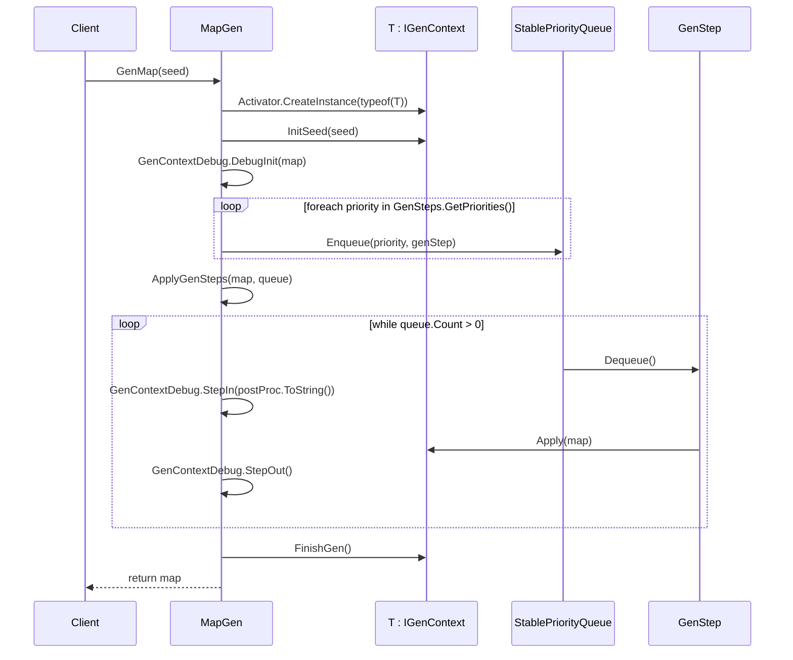
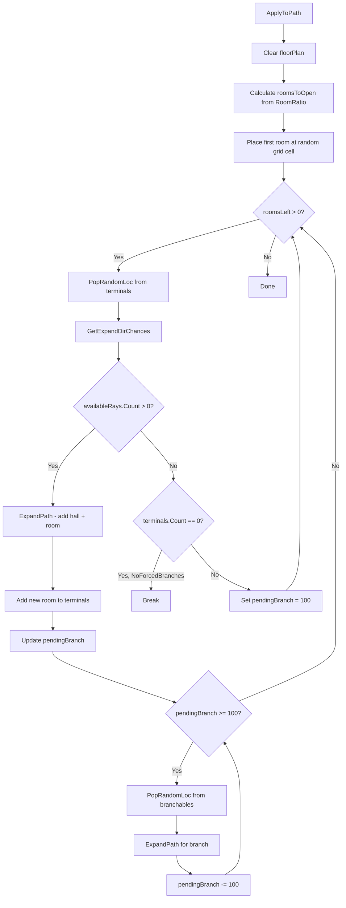
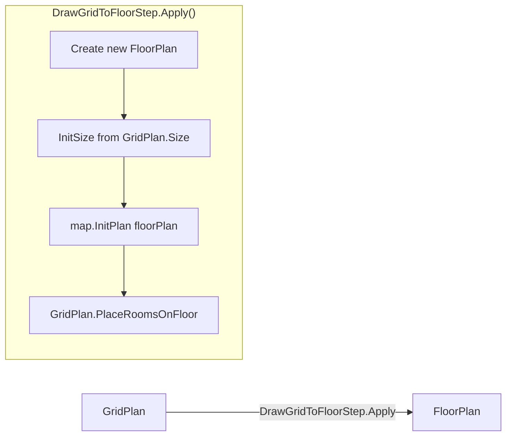
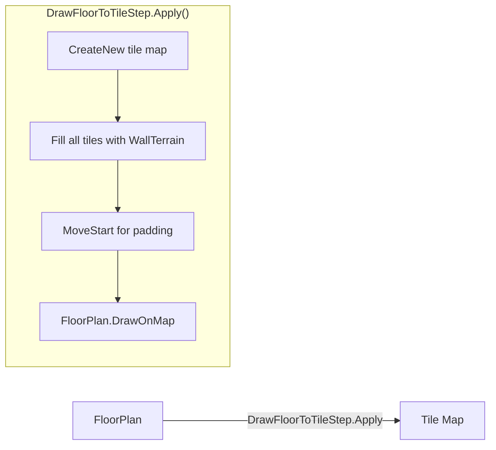
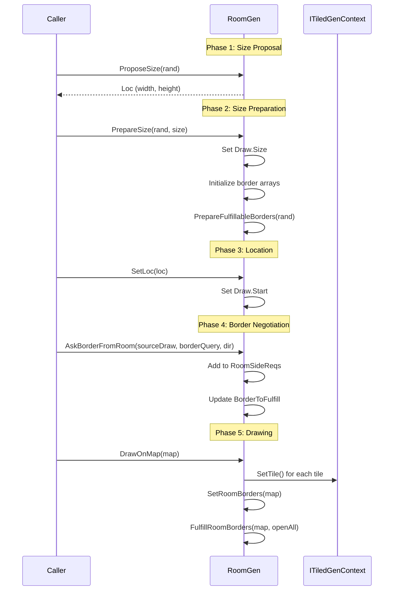
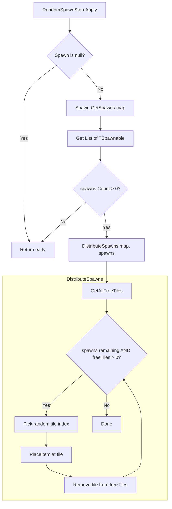
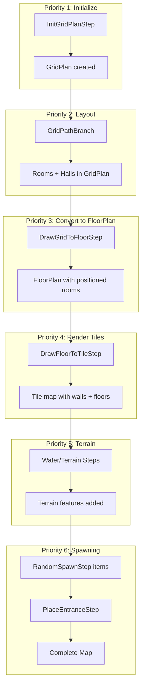

# Code Flow Documentation

Traced code paths for key operations in RogueElements.

## 1. MapGen.GenMap() Flow

The main entry point for procedural map generation.



**Source**: `RogueElements/MapGen/MapGen.cs:123-144`

```csharp
public T GenMap(ulong seed)
{
    T map = (T)Activator.CreateInstance(typeof(T));  // Line 126
    map.InitSeed(seed);                              // Line 127
    GenContextDebug.DebugInit(map);                  // Line 129

    // Build priority queue from GenSteps
    StablePriorityQueue<Priority, IGenStep> queue = new StablePriorityQueue<Priority, IGenStep>();
    foreach (Priority priority in this.GenSteps.GetPriorities())
    {
        foreach (IGenStep genStep in this.GenSteps.GetItems(priority))
            queue.Enqueue(priority, genStep);
    }

    ApplyGenSteps(map, queue);  // Line 139 - executes each step
    map.FinishGen();            // Line 141
    return map;
}
```

---

## 2. Grid-Based Room Generation Flow (GridPathBranch)

Creates a branching tree layout on a grid.



**Source**: `RogueElements/MapGen/Grid/Paths/IGridPathBranch.cs:111-205`

Key methods:
- `ApplyToPath()` - Main algorithm loop (line 111)
- `ExpandPath()` - Adds hall and room (line 250-257)
- `GetExpandDirChances()` - Gets valid expansion directions (line 277-283)
- `PopRandomLoc()` - Selects next terminal to expand (line 266-269)

```csharp
// ExpandPath creates a hall and room in one direction
protected bool ExpandPath(IRandom rand, GridPlan floorPlan, LocRay4 chosenRay)
{
    floorPlan.SetHall(chosenRay, this.GenericHalls.Pick(rand), this.HallComponents.Clone());
    floorPlan.AddRoom(chosenRay.Traverse(1), this.GenericRooms.Pick(rand), this.RoomComponents.Clone());
    GenContextDebug.DebugProgress("Added Path");
    return true;
}
```

---

## 3. GridPlan -> FloorPlan -> Tiles Conversion

The two-step rendering process that converts abstract layouts to actual tiles.

### Step 1: DrawGridToFloorStep

**Source**: `RogueElements/MapGen/Grid/DrawGridToFloorStep.cs:45-52`



```csharp
public override void Apply(T map)
{
    var floorPlan = new FloorPlan();
    floorPlan.InitSize(map.GridPlan.Size, map.GridPlan.Wrap);
    map.InitPlan(floorPlan);
    map.GridPlan.PlaceRoomsOnFloor(map);  // Converts grid cells to floor rooms
}
```

**GridPlan.PlaceRoomsOnFloor** (`GridPlan.cs:206-329`):
1. `ChooseRoomBounds()` - Determines tile-space bounds for each room
2. `ChooseHallBounds()` - Calculates hall dimensions between cells
3. Adds rooms to FloorPlan (as rooms or halls based on PreferHall)
4. Connects rooms with hall segments

### Step 2: DrawFloorToTileStep

**Source**: `RogueElements/MapGen/FloorPlan/DrawFloorToTileStep.cs:56-76`



```csharp
public override void Apply(T map)
{
    // Create tile map with padding
    map.CreateNew(
        map.RoomPlan.DrawRect.Width + (2 * this.Padding),
        map.RoomPlan.DrawRect.Height + (2 * this.Padding),
        map.RoomPlan.Wrap);

    // Fill with walls
    for (int ii = 0; ii < map.Width; ii++)
        for (int jj = 0; jj < map.Height; jj++)
            map.SetTile(new Loc(ii, jj), map.WallTerrain.Copy());

    map.RoomPlan.MoveStart(new Loc(this.Padding));
    map.RoomPlan.DrawOnMap(map);  // Draws all rooms and halls
}
```

**FloorPlan.DrawOnMap** (`FloorPlan.cs:618-681`):
1. For each room: negotiate borders with adjacent rooms, then call `RoomGen.DrawOnMap()`
2. For each hall: negotiate borders with adjacent halls, then call `RoomGen.DrawOnMap()`
3. Border info transfers via `TransferBorderToAdjacents()`

---

## 4. Room Generation Flow (RoomGen)

The lifecycle of a room generator.



**Key files**:
- `RoomGen.cs:121` - `ProposeSize()`
- `RoomGen.cs:128-163` - `PrepareSize()`
- `RoomGen.cs:169-174` - `SetLoc()`
- `RoomGen.cs:251` - `DrawOnMap()` (abstract)

### RoomGenSquare Example

**Source**: `RogueElements/MapGen/Rooms/RoomGenSquare.cs`

```csharp
// ProposeSize: Returns random size within configured ranges
public override Loc ProposeSize(IRandom rand)
{
    return new Loc(this.Width.Pick(rand), this.Height.Pick(rand));  // Line 60-63
}

// DrawOnMap: Delegates to base class default drawing
public override void DrawOnMap(T map)
{
    this.DrawMapDefault(map);  // Line 66-69 -> fills rectangle with RoomTerrain
}
```

**DrawMapDefault** (`RoomGen.cs:462-472`):
```csharp
protected void DrawMapDefault(T map)
{
    for (int x = 0; x < this.Draw.Size.X; x++)
        for (int y = 0; y < this.Draw.Size.Y; y++)
            map.SetTile(new Loc(this.Draw.X + x, this.Draw.Y + y), map.RoomTerrain.Copy());

    this.SetRoomBorders(map);  // Updates OpenedBorder based on walkable tiles
}
```

---

## 5. Spawning Flow (RandomSpawnStep)

How items, enemies, and other entities are placed on the map.



**Source**:
- `IBaseSpawnStep.cs:78-87` - `BaseSpawnStep.Apply()`
- `RandomSpawnStep.cs:44-57` - `DistributeSpawns()`

```csharp
// BaseSpawnStep.Apply - Gets spawns and distributes them
public override void Apply(TGenContext map)
{
    if (this.Spawn is null)
        return;

    List<TSpawnable> spawns = this.Spawn.GetSpawns(map);  // Line 83

    if (spawns.Count > 0)
        this.DistributeSpawns(map, spawns);  // Line 86
}

// RandomSpawnStep.DistributeSpawns - Places on random free tiles
public override void DistributeSpawns(TGenContext map, List<TSpawnable> spawns)
{
    List<Loc> freeTiles = map.GetAllFreeTiles();  // Line 46

    for (int ii = 0; ii < spawns.Count && freeTiles.Count > 0; ii++)
    {
        TSpawnable item = spawns[ii];
        int randIndex = map.Rand.Next(freeTiles.Count);      // Line 52
        map.PlaceItem(freeTiles[randIndex], item);           // Line 53
        freeTiles.RemoveAt(randIndex);                       // Line 54
        GenContextDebug.DebugProgress("Placed Object");
    }
}
```

### Spawn Step Hierarchy

```
BaseSpawnStep<TGenContext, TSpawnable>
  |
  +-- RandomSpawnStep      (random free tiles)
  +-- SpecificSpawnStep    (predefined locations)
  +-- TerrainSpawnStep     (specific terrain types)
  +-- RoomSpawnStep        (room-based distribution)
        |
        +-- RandomRoomSpawnStep  (random rooms)
        +-- TerminalSpawnStep    (dead-end rooms)
        +-- DueSpawnStep         (distance-based)
```

---

## Summary: Complete Generation Pipeline

A typical grid-based dungeon follows this flow:


