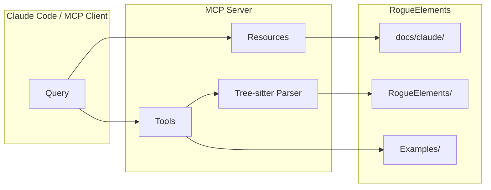

# RogueElements MCP Server

[](https://modelcontextprotocol.io/)
[](https://nodejs.org/)
[](https://opensource.org/licenses/MIT)

MCP (Model Context Protocol) server providing AI-optimized documentation, code generation, and exploration tools for the RogueElements procedural map generation library.

## Features

### Tools

| Tool | Description |
|------|-------------|
| `rogue_search` | Search for classes across all categories by name or summary |
| `rogue_list_classes` | List all classes in a specific category |
| `rogue_get_class_docs` | Get detailed XML documentation for a specific class |
| `rogue_get_docs` | Access AI-optimized architecture, flows, and patterns documentation |
| `rogue_get_example` | Get annotated source code from the Examples project |
| `rogue_scaffold_roomgen` | Generate boilerplate for a custom RoomGen |
| `rogue_scaffold_genstep` | Generate boilerplate for a custom GenStep |
| `rogue_scaffold_spawnable` | Generate boilerplate for a custom spawnable entity |
| `rogue_list_interfaces` | List context interfaces with their capabilities |

### Class Categories

Use with `rogue_list_classes` and `rogue_search`:

| Category | Description |
|----------|-------------|
| `genstep` | Generation steps (InitTilesStep, GridPathBranch, etc.) |
| `roomgen` | Room shape generators (RoomGenSquare, RoomGenCave, etc.) |
| `gridpath` | Grid-based path algorithms |
| `floorpath` | FloorPlan-based path algorithms |
| `spawning` | Entity placement (RandomSpawnStep, PickerSpawner, etc.) |
| `tiles` | Tile manipulation steps |
| `rand` | RNG and weighted selection utilities |
| `context` | Generation context interfaces |
| `priority` | Priority queue system |
| `floorplan` | FloorPlan data structures |
| `gridplan` | GridPlan data structures |
| `core` | Core utilities (Loc, Rect, Grid, etc.) |

### Documentation Resources

Use with `rogue_get_docs`:

| Document | Description |
|----------|-------------|
| `architecture` | Interface hierarchy, GenStep categories, data flow diagrams |
| `flows` | Traced code paths for key operations |
| `patterns` | Step-by-step recipes for common modifications |

### Examples

Use with `rogue_get_example`:

| Example | Concepts |
|---------|----------|
| `Ex1_Tiles` | Static tiles, InitTilesStep basics |
| `Ex2_Rooms` | Freeform rooms via FloorPlan |
| `Ex3_Grid` | Grid-based layouts via GridPlan |
| `Ex4_Stairs` | Stair placement and spawning |
| `Ex5_Terrain` | Water and terrain via Perlin noise |
| `Ex6_Items` | Item spawning and spawn lists |
| `Ex7_Special` | Special room placement |
| `Ex8_Integration` | Full pipeline combining all concepts |

## Installation

```bash
cd mcp-server
npm install
npm run build
```

## Usage

### With Claude Code

Add to your Claude Code MCP settings:

**macOS**: `~/.claude/claude_desktop_config.json`
**Linux**: `~/.config/claude/claude_desktop_config.json`

```json
{
  "mcpServers": {
    "rogueelemens": {
      "command": "node",
      "args": ["/path/to/RogueElements/mcp-server/dist/index.js"]
    }
  }
}
```

### Development

```bash
# Watch mode with auto-reload
npm run dev

# Build for production
npm run build

# Run the server
npm start
```

## Example Tool Usage

### Search for Classes

```
Tool: rogue_search
Args: { "query": "water", "limit": 5 }
```

Returns classes matching "water" across all categories.

### List Classes in Category

```
Tool: rogue_list_classes
Args: { "category": "spawning" }
```

Lists all spawning-related classes with summaries.

### Get Class Documentation

```
Tool: rogue_get_class_docs
Args: { "class_name": "GridPathBranch" }
```

Returns detailed XML documentation including:
- Class summary and remarks
- Constructor documentation
- Public properties with types and descriptions
- Public methods with signatures
- Related classes

### Get Architecture Docs

```
Tool: rogue_get_docs
Args: { "name": "architecture" }
```

Returns interface hierarchy, GenStep categories, and data flow diagrams.

### Get Example Code

```
Tool: rogue_get_example
Args: { "name": "Ex3_Grid" }
```

Returns annotated source code for grid-based generation.

### Scaffold a RoomGen

```
Tool: rogue_scaffold_roomgen
Args: {
  "name": "Diamond",
  "shape_description": "diamond-shaped room with configurable size"
}
```

Generates:

```csharp
[Serializable]
public class RoomGenDiamond<T> : RoomGen<T>
    where T : ITiledGenContext
{
    public RandRange Size { get; set; }

    public RoomGenDiamond() { }

    public RoomGenDiamond(RandRange size)
    {
        this.Size = size;
    }

    protected RoomGenDiamond(RoomGenDiamond<T> other)
    {
        this.Size = other.Size;
    }

    public override RoomGen<T> Copy() => new RoomGenDiamond<T>(this);

    public override Loc ProposeSize(IRandom rand)
    {
        int size = this.Size.Pick(rand);
        return new Loc(size, size);
    }

    public override void DrawOnMap(T map)
    {
        // TODO: Implement diamond-shaped room drawing
        // Draw a diamond-shaped room with configurable size
        this.DrawMapDefault(map);
        this.SetRoomBorders(map);
    }
}
```

### Scaffold a GenStep

```
Tool: rogue_scaffold_genstep
Args: {
  "name": "AddPillars",
  "context_type": "ITiledGenContext",
  "description": "Adds decorative pillars to rooms"
}
```

### Scaffold a Spawnable

```
Tool: rogue_scaffold_spawnable
Args: {
  "name": "Treasure",
  "description": "Treasure chest with gold value",
  "spawn_type": "terminal"
}
```

Generates both a spawnable entity class and a spawn step.

### List Interfaces

```
Tool: rogue_list_interfaces
Args: {}
```

Returns the interface hierarchy with capabilities for each:

```
IGenContext (base)
├── ITiledGenContext
│   └── IFloorPlanGenContext
│       └── IRoomGridGenContext
├── IPlaceableGenContext<T>
│   └── IViewPlaceableGenContext<T>
│       └── IReplaceableGenContext<T>
└── ISpawningGenContext<T>
```

## Architecture



## Requirements

- Node.js >= 18
- Built from RogueElements repository root (needs `docs/claude/` and source directories)

## See Also

- **[RogueElements](../RogueElements/)** - Core library
- **[RogueElements.Examples](../RogueElements.Examples/)** - Usage examples
- **[CLAUDE.md](../CLAUDE.md)** - Full architecture documentation

---


